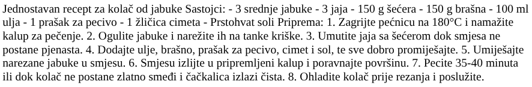

<div>

# Web dizajn i aplikacija

**Nositelj**: izv. prof. dr. sc. Snježana  
**Suradnik**: mag. inf. Alesandro Žužić  

**Ustanova**: Sveučilište Jurja Dobrile u Puli, Fakultet dizajn i audiovizualne komunikacije

<p style="float: clear; display: flex; gap: 8px; align-items: center;" class="font-brioni text-sm whitespace-nowrap">
    </img>
    Fakultet dizajn i audiovizualne komunikacije
</p>

# [1] HTML Osnove

**Posljednje ažurirano:** 21. listopada 2025.

## Sadržaj
<!-- TOC -->

- [Web dizajn i aplikacija](#web-dizajn-i-aplikacija)
- [[1] HTML Osnove](#1-html-osnove)
    - [Sadržaj](#sadr%C5%BEaj)
    - [Uvod](#uvod)
    - [IDE](#ide)
        - [Postavljanje](#postavljanje)
    - [HTML](#html)
    - [Osnovni HTML elementi](#osnovni-html-elementi)
        - [Tekstualni elementi: paragrafi, naslovi](#tekstualni-elementi-paragrafi-naslovi)
            - [Paragraf](#paragraf)
            - [Naslovi headers*](#naslovi-headers)
            - [Implementacija strukturne hijerarhije](#implementacija-strukturne-hijerarhije)
            - [Zašto nam treba struktura?](#za%C5%A1to-nam-treba-struktura)
            - [Zašto nam treba semantika?](#za%C5%A1to-nam-treba-semantika)
        - [Naglašavanje i važnost u HTML-u](#nagla%C5%A1avanje-i-va%C5%BEnost-u-html-u)
            - [Naglašavanje emphasis*](#nagla%C5%A1avanje-emphasis)
            - [Ugniježđivanje elemenata](#ugnije%C5%BE%C4%91ivanje-elemenata)
            - [Snažan naglasak strong importance*](#sna%C5%BEan-naglasak-strong-importance)
            - [Kombiniranje naglaska i važnosti](#kombiniranje-naglaska-i-va%C5%BEnosti)
            - [Mark](#mark)
            - [Kurziv, podebljano, podcrtano…](#kurziv-podebljano-podcrtano)
        - [Liste](#liste)
            - [Nenumerirane liste unordered list*](#nenumerirane-liste-unordered-list)
            - [Numerirane liste ordered list*](#numerirane-liste-ordered-list)
            - [Ugniježđivanje lista](#ugnije%C5%BE%C4%91ivanje-lista)
            - [Opisne liste](#opisne-liste)
        - [Samostalni zadatak za vježbu 1](#samostalni-zadatak-za-vje%C5%BEbu-1)
        - [Ostali tekstualni elementi](#ostali-tekstualni-elementi)
            - [Superscript & subscript](#superscript--subscript)
            - [Predstavljanje računalnog kôda](#predstavljanje-ra%C4%8Dunalnog-k%C3%B4da)
        - [Strukturiranje dokumenata](#strukturiranje-dokumenata)
            - [Osnovni dijelovi dokumenta](#osnovni-dijelovi-dokumenta)
            - [Ne-semantički omotači](#ne-semanti%C4%8Dki-omota%C4%8Di)
            - [Prijelomi redaka i vodoravne crte](#prijelomi-redaka-i-vodoravne-crte)
        - [Void elementi](#void-elementi)
        - [Atributi](#atributi)
            - [Boolean atributi](#boolean-atributi)
        - [Stvaranje poveznica](#stvaranje-poveznica)
            - [Što je hiperveza?](#%C5%A0to-je-hiperveza)
            - [Anatomija poveznice](#anatomija-poveznice)
        - [HTML slike](#html-slike)
            - [Kako staviti sliku na web stranicu?](#kako-staviti-sliku-na-web-stranicu)
            - [Širina i visina](#%C5%A0irina-i-visina)
        - [Samostalni zadatak za vježbu 2](#samostalni-zadatak-za-vje%C5%BEbu-2)
        - [Osnove HTML tablica](#osnove-html-tablica)
            - [Kako tablica funkcionira?](#kako-tablica-funkcionira)
            - [Izrada prve tablice](#izrada-prve-tablice)
            - [Proširivanje ćelija](#pro%C5%A1irivanje-%C4%87elija)
        - [Samostalni zadatak za vježbu 3](#samostalni-zadatak-za-vje%C5%BEbu-3)
    - [Tablica elementa](#tablica-elementa)

<!-- /TOC -->

## Uvod
U ovoj sekciji ćemo se osvrnuti na osnove Web stranice.

Zamislite da web stranica nije samo skup riječi i slika, već pravo **tijelo**. Baš kao i tijelo, stranica ima različite dijelove koji zajedno omogućuju život i funkcionalnost:

- **HTML** je kostur – daje strukturu stranici. Bez kostura, stranica bi bila kaotična, sve bi padalo i ništa ne bi imalo oblik. Tu definiramo naslove, paragrafe, slike i linkove – sve osnovne dijelove tijela

- **CSS** je koža – daje oblik, boje i stil. CSS čini da stranica izgleda lijepo i privlačno, baš kao koža i odjeća koja pokriva kostur i definira vanjski izgled

- **JavaScript (JS)** su mozak i živci – omogućuju interakciju, reakcije i dinamiku. Kroz JS stranica “misli” i reagira na korisnika: klikove, unos teksta, animacije… bez mozga i živaca, stranica bi samo stajala i ništa se ne bi događalo


Baš kao što tijelo treba red i strukturu da bi pravilno funkcioniralo, tako i HTML mora biti pravilno organiziran. Ako zamijenimo dijelove ili ih zaboravimo, stranica neće funkcionirati kako spada.

## IDE
> **IDE (*Integrated Development Environment*)**

**IDE** je integrirano razvojno okruženje koje programerima omogućuje da na jednom mjestu pišu, uređuju, testiraju i pokreću svoj kôd. Umjesto da koriste više različitih alata (*npr. poseban uređivač teksta, terminal i preglednik datoteka*), IDE sve to objedinjuje u jedno sučelje.

### Postavljanje

U sljedećim koracima instalirat ćemo sve potrebne alate i ekstenzije za razvoj stranica. Za svrhu ovog kolegija koristit ćemo integrirano razvojno okruženje **Visual Studio Code**.

</img>

1. **Instalacija Visual Studio Code**, potrebno je preuzet i instalirat Visual Studio Code s [code.visualstudio.com](https://code.visualstudio.com) stranice.

<div>
    
    <br/>
    <p style="width: 100%; text-align: center;"><i>VS Code Download Stranica</i></p>
</div>

2. Početni pregled nakon instalacije ima otvoren početni prozor i AI chat sa strane (*nisu nam potrebni i nećemo ih koristiti na vježbama*), oboje treba zatvoriti i na lijevom izborniku odabrati `Explorer` tab.

<div style="width: fit-content; display: flex; flex-direction: column;">
    
    <br/>
    <p style="margin-top: -16px; width: 100%; text-align: center;"><i>VS Code - Explorer Tab</i></p>
</div>

2. Zatim ćemo stvoriti novu datoteku tako da kliknemo na `New File...` ikonu i nazvati je `index.html`. Sakrit ćemo početni placeholder text tako da kliknemo `don't show` plavi tekst. Vrlo je bitno da je ekstenzija datoteke `.html`, jer time naglašujemo da je to HTML datoteka koju web preglednik onda može prepoznati i otvoriti.

<div style="width: fit-content; display: flex; flex-direction: column;">
    <div style="display: flex; justify-content: center;">
        
    </div>
    <br/>
    <p style="margin-top: -16px; width: 100%; text-align: center;"><i>Explorer Tab - Nova Datoteka</i></p>
</div>

> `index` je početna ili zadana web stranica koja se automatski učitava pri otvaranju web-mjesta ili direktorija

3. Kada imamo html datoteku možemo je otvoriti u pregledniku svojeg izbora. Međutim svaki put kada napravimo novu promjenu unutar datoteke moramo iznova ručno osvježiti stranicu. Da bi izbjegli ručno osvježavanje stranice, instalirat ćemo ekstenziju `Live Server` tako da odemo u `Extensions` tab u lijevom izborniku, pretražimo ju i kliknemo `Install`.

<div style="width: fit-content; display: flex; flex-direction: column;">
    <div style="display: flex; justify-content: center;">
        
    </div>
    <br/>
    <p style="margin-top: -16px; width: 100%; text-align: center;"><i>Extensions Tab - Live Server</i></p>
</div>

4. Sada imamo sve što nam je potrebno za rad sa HTML-om. Sljedeći korak nam je samo dodati osnovni kôd svake web stranice; više o strukturi HTML-a u sljedećem poglavlju:

```html
<!DOCTYPE html>
<html>
    <head>
        <title>Primjer</title>
    </head>
    <body>
        Hello, World!
    </body>
</html>
```

<div style="width: fit-content; display: flex; flex-direction: column;">
    <div style="display: flex; justify-content: center;">
        
    </div>
    <br/>
    <p style="margin-top: -16px; width: 100%; text-align: center;"><i>obični <code>index.html</code></i></p>
</div>

## HTML
> **HTML (*HyperText Markup Language*)**

**HTML** je markup jezik (***eng. [markup language](https://en.wikipedia.org/wiki/Markup_language#:~:text=July%202023content%20to%20facilitate%20automated%20processing.)***) koji se koristi za strukturiranje sadržaja web stranica. Sastoji se od HTML elemenata koji se koriste za označavanje dijelova sadržaja. Svaki [HTML element](https://developer.mozilla.org/en-US/docs/Learn_web_development/Core/Structuring_content/Basic_HTML_syntax#anatomy_of_an_html_element) sastoji se od otvarajuće oznake (***eng. opening tag***), sadržaja elementa (***eng. content***) i zatvarajuće oznake (***eng. closing tag***).

<div style="width: fit-content; display: flex; flex-direction: column;">
    
    <br/>
    <p style="margin-top: -16px; width: 100%; text-align: center;"><i>HTML element</i></p>
</div>

Osnovna struktura HTML dokumenta uvijek sadrži `<!DOCTYPE html>`, `<head>` i `<body>` djelove:
- `<!DOCTYPE html>` deklaracija tipa dokumenta koja govori pregledniku da se radi o **HTML5** stranici
- `<head>` dio obično sadrži meta informacije o dokumentu, kao što su naslov stranice, veze prema CSS datotekama, skripte itd. 
- `<body>` dio sadrži glavni sadržaj stranice, poput zaglavlja (*header*), navigacije (*nav*), članaka (*article*) i podnožja (*footer*)

*Primjer jednostavne web stranice:*
```html
<!DOCTYPE html>
<html>
    <head>
        <title>Moja web stranica</title>
    </head>

    <body>
        <header>
            <h1>Naslov</h1>
            <nav>
                <ul>
                    <li><a href="#">Početna</a></li>
                    <li><a href="#">O nama</a></li>
                    <li><a href="#">Kontakt</a></li>
                </ul>
            </nav>
        </header>

        <main>
            <article>
                <h2>Članak 1</h2>
                <p>Ovo je prvi članak.</p>
            </article>

            <article>
                <h2>Članak 2</h2>
                <p>Ovo je drugi članak.</p>
            </article>
        </main>

        <footer>
            <p>&copy; 2025 Web Stranica</p>
        </footer>
    </body>
</html>
```

<div style="width: fit-content; display: flex; flex-direction: column;">
    <div style="display: flex; justify-content: center;">
        
    </div>
    <br/>
    <p style="margin-top: -16px; width: 100%; text-align: center;"><i>Primjer jednostavne web stranice</i></p>
</div>

```html
<!DOCTYPE html>
<html>

    <head>
        <title>Naziv stranice</title>
    </head>

    <body>
        Sadržaj
    </body>

</html>
```

Mi ćemo za svaku html datoteku uvijek koristiti ovu gornju strukturu kao početni kôd. Te sav kôd koji budemo pisali u sljedećem poglavlju nalazit će se unutar `body` elementa. Tako da u donjim primjerima neće pisati cijeli kôd, već samo onaj dio unutar `body` elementa.

## Osnovni HTML elementi

U ovoj sekciji upoznat ćemo se s osnovnim građevnim blokovima HTML-a. Svaka web stranica sastoji se od različitih elemenata koji omogućuju prikaz teksta, naslova, slika, poveznica i lista. Razumijevanje ovih elemenata ključno je za pravilno strukturiranje sadržaja i izradu funkcionalnih stranica.

Nakon ovog dijela, moći ćete samostalno dodavati osnovne tekstualne i vizualne komponente te ih organizirati u logičnu i preglednu strukturu.

### Tekstualni elementi: paragrafi, naslovi

Većina strukturiranog teksta sastoji se od naslova i paragrafa, bilo da čitate priču, novine, udžbenik ili časopis. HTML nudi različite elemente za organizaciju i prikaz teksta. Osnovni su **paragrafi**, **naslovi**.

<div style="width: fit-content; display: flex; flex-direction: column;">
    <div style="display: flex; justify-content: center;">
        
    </div>
    <br/>
    <p style="margin-top: -16px; width: 100%; text-align: center;"><i>Stare Novine</i></p>
</div>

> Strukturirani sadržaj čini čitanje lakšim i ugodnijim.

#### Paragraf

Paragraf je osnovni blok teksta u HTML-u koji omogućuje da se sadržaj jasno odvoji i organizira u logične cjeline. Svaki paragraf automatski dobiva **vertikalni razmak** od ostalih elemenata.

```html
<p>Ovo je paragraf teksta.</p>
<p>Još     jedan    paragraf    s     informacijama.</p>
<p>
    
    Treći paragraf.

</p>
```

<div style="width: fit-content; display: flex; flex-direction: column;">
    <div style="display: flex; justify-content: center;">
        
    </div>
    <br/>
    <p style="margin-top: -16px; width: 100%; text-align: center;"><i>Primjer paragrafa</i></p>
</div>

> Bez obzira na to koliko razmaka ili praznih redaka koristite unutar sadržaja HTML elementa, preglednik će prilikom prikaza **sve uzastopne razmake i prijelome linija smanjiti na jedan razmak**. Pa zašto onda koristiti toliko praznog prostora? Odgovor je **čitkost kôda**. Lakše je razumjeti što se događa u vašem kôdu ako je lijepo formatiran. Stil formatiranja (*koliko razmaka za svaki nivo uvlačenja, na primjer*) prepušten je vama, ali **trebali biste razmotriti njegovo korištenje radi preglednosti**.


#### Naslovi (headers)*)

Naslovi služe za organizaciju sadržaja stranice u hijerarhijsku strukturu. Postoji šest razina naslova, od `<h1>` (*glavno poglavlje; najvažniji i obično jedini glavni naslov stranice*), `<h2>` (*podpoglavlje*), `<h3>` (*pod-podpoglavlje*) do `<h6>` (*pod-pod-pod-pod-podpoglavlje; najmanje važno*).

```html
<h1> h1 - Glavni naslov stranice </h1>
<h2> h2 - Sekcija ili poglavlje </h2>
<h3> h3 - Podsekcija unutar poglavlja </h3>
<h4> h4 - Detaljnija tema unutar podsekcije </h4>
<h5> h5 - Još specifičnija tema </h5>
<h6> h6 - Najmanje važan ili dodatni detalj </h6>
```

<div style="width: fit-content; display: flex; flex-direction: column;">
    <div style="display: flex; justify-content: center;">
        
    </div>
    <br/>
    <p style="margin-top: -16px; width: 100%; text-align: center;"><i>Primjer naslova: h1 - h6</i></p>
</div>

> Možemo uočiti da je svaki naslov podebljan i ima svoju veličinu fonta i visinu linije

#### Implementacija strukturne hijerarhije

Na primjer, u ovoj priči element `<h1>` predstavlja naslov priče, elementi `<h2>` predstavljaju naslove poglavlja, a elementi `<h3>` podnaslove unutar poglavlja:

```html
<h1>The Fellowship of the Ring</h1>

<p>By J.R.R. Tolkien</p>

<h2>Chapter 1: A Long-expected Party</h2>

<p>
  Bilbo Baggins was preparing for his eleventy-first birthday party in the Shire. 
  Hobbits gathered from all around, enjoying the festivities and fireworks...
</p>

<h2>Chapter 2: The Shadow of the Past</h2>

<p>
  Frodo reflects on the mysterious ring left by Bilbo. Gandalf warns him of its dangerous power...
</p>

<h3>Gandalf Explains the Ring</h3>

<p>
  Gandalf recounts the history of the One Ring, its connection to Sauron, and the threat it poses to Middle-earth...
</p>
```

<div style="width: fit-content; display: flex; flex-direction: column;">
    <div style="display: flex; justify-content: center;">
        
    </div>
    <br/>
    <p style="margin-top: -16px; width: 100%; text-align: center;"><i>Primjer strukturne hijerarhije</i></p>
</div>

Ovisno o vama, elementi mogu predstavljati različite dijelove sadržaja, sve dok hijerarhija ima smisla. Pri stvaranju takvih struktura vrijedi pridržavati se nekoliko dobrih praksi:

- Preporučuje se koristiti **jedan `<h1>` po stranici** — to je naslov najviše razine, a svi ostali naslovi su hijerarhijski niže
- Pazite da naslove koristite u ispravnom redoslijedu hijerarhije. Nemojte koristiti `<h3>` za podnaslove, a zatim `<h2>` za još dublje podnaslove — to ne daje smislen rezultat i može dovesti do problema
- Od šest dostupnih razina naslova, preporučuje se koristiti **najviše** tri po stranici, osim ako nije nužno. Dokumenti s previše razina postaju teški za pregledavanje i navigaciju. U takvim slučajevima bolje je sadržaj raspodijeliti na više stranica ako je moguće.

#### Zašto nam treba struktura?

Da bismo odgovorili na ovo pitanje, pogledajmo sljedeći primjer - jednostavan recept za humus. 

```html
<body>
    Jednostavan recept za kolač od jabuke

    Sastojci:

    - 3 srednje jabuke
    - 3 jaja
    - 150 g šećera
    - 150 g brašna
    - 100 ml ulja
    - 1 prašak za pecivo
    - 1 žličica cimeta
    - Prstohvat soli

    Priprema:

    1. Zagrijte pećnicu na 180°C i namažite kalup za pečenje.
    2. Ogulite jabuke i narežite ih na tanke kriške.
    3. Umutite jaja sa šećerom dok smjesa ne postane pjenasta.
    4. Dodajte ulje, brašno, prašak za pecivo, cimet i sol, te sve dobro promiješajte.
    5. Umiješajte narezane jabuke u smjesu.
    6. Smjesu izlijte u pripremljeni kalup i poravnajte površinu.
    7. Pecite 35-40 minuta ili dok kolač ne postane zlatno smeđi i čačkalica izlazi čista.
    8. Ohladite kolač prije rezanja i poslužite.
</body>
```

Tijelo ovog dokumenta trenutno sadrži više dijelova sadržaja koji nisu označeni nijednim HTML elementom, već su odvojeni samo prijelomima linija i razmacima. Tekst uzgleda strukturirano, međutim, kada otvorite dokument u pregledniku, tekst se prikazuje kao **jedna velika cjelina**:

<div style="width: fit-content; display: flex; flex-direction: column;">
    <div style="display: flex; justify-content: center;">
        
    </div>
    <br/>
    <p style="margin-top: -16px; width: 100%; text-align: center;"><i>Primjer bez strukturne hijerarhije</i></p>
</div>

Web stranica koja prikazuje zid neformatiranog teksta čini čitanje teškim, jer nema elemenata koji bi dali strukturu sadržaju. Preglednik ne zna što je naslov, a što paragraf.

- Korisnici obično brzo skeniraju stranicu kako bi pronašli relevantan sadržaj, često prvo čitajući naslove. [Obično provode vrlo kratko vrijeme na web stranici](https://www.nngroup.com/articles/how-long-do-users-stay-on-web-pages/), ako ne vide ništa korisno u nekoliko sekundi, vjerojatno će napustiti stranicu.
- Tražilice prilikom indeksiranja stranice smatraju naslove važnim ključnim riječima koje utječu na [SEO](https://developer.mozilla.org/en-US/docs/Glossary/SEO) (*Search Engine Optimization*). Bez naslova, stranica će lošije rangirati.
- Osobe s jakim oštećenjem vida često ne čitaju web stranice, već ih **slušaju** pomoću softvera zvanog **screen reader**. Ovaj softver omogućuje brzi pristup sadržaju tako da čita naslove, što korisnicima omogućuje pronalaženje informacija bez slušanja cijelog teksta. Ako naslovi nisu dostupni, prisiljeni su slušati cijeli dokument.
- Za **stiliziranje** sadržaja pomoću **CSS-a** ili dodavanje interakcija s **JavaScriptom** potrebno je imati elemente koji obavijaju relevantni sadržaj, kako bi **CSS** i **JS** mogli učinkovito ciljati te dijelove.

Zbog svega navedenog, **sadržaj moramo strukturirati pomoću HTML elemenata**.

#### Zašto nam treba semantika?

> Semantika je prisutna svuda oko nas – oslanjamo se na prethodno iskustvo da bismo znali čemu služi neki predmet u svakodnevnom životu. Kada nešto vidimo, znamo koja je njegova funkcija. Na primjer, očekujemo da crveno svjetlo na semaforu znači "stop", a zeleno svjetlo znači "kreni". Problemi nastaju ako se pogrešna semantika primijeni (*postoji li neka država gdje crveno znači "kreni"? Nadamo se da ne*).

Na sličan način, na webu moramo koristiti ispravne HTML elemente kako bismo sadržaju dali točno značenje, funkciju ili izgled. U tom kontekstu, element `<h1>` je **semantički element** koji tekstu koji obavija daje ulogu (*značenje*) "naslova najviše razine na stranici".

### Naglašavanje i važnost u HTML-u

> U prethodnom smo podpoglavlju govorili o važnosti semantike u HTML-u, s fokusom na naslove i paragrafe. Ovdje nastavljamo s istom temom, ali proučavamo **HTML elemente koji dodaju naglasak ili važnost tekstu** (*slično kurzivu i podebljanom tekstu u tiskanom obliku*).

U svakodnevnom jeziku često naglašavamo određene riječi kako bismo promijenili značenje rečenice ili istaknuli njezine dijelove. HTML nam omogućuje da to isto napravimo u pisanom obliku pomoću semantičkih elemenata koji imaju točno određenu ulogu i značenje.

#### Naglašavanje (emphasis)*)

Kada želimo dodati **naglasak** u govoru, izgovaramo određene riječi jače ili drugačijim tonom, čime mijenjamo značenje rečenice. U pisanju to obično radimo **kurzivom (italic)**.

Primjerice, sljedeće dvije rečenice na hrvatskom imaju različito značenje:

* Meni je baš drago da nisi zakasnio.
* *Meni* je *baš* drago da nisi *zakasnio.*

Prva zvuči iskreno i neutralno, dok druga — s naglaskom na određenim riječima — može djelovati sarkastično ili ironično, ovisno o kontekstu i tonu.

U HTML-u za ovakve situacije koristimo element **`<em>`** (*emphasis*). Osim što poboljšava čitljivost, ovaj element prepoznaju i čitači ekrana, koji ga mogu izgovarati drugačijim tonom. Preglednici ga po zadanom prikazuju *kurzivno*, ali **ne treba ga koristiti isključivo zbog vizualnog efekta** — za to se koristi `<span>` element uz CSS stilove, ili `<i>` element.

```html
<p>
    <em>Meni</em> je <em>baš</em> drago da nisi <em>zakasnio</em>.
</p>

<p>
    <i>Meni</i> je <i>baš</i> drago da nisi <i>zakasnio</i>.
</p>
```

<div style="width: fit-content; display: flex; flex-direction: column;">
    <div style="display: flex; justify-content: center;">
        
    </div>
    <br/>
    <p style="margin-top: -16px; width: 100%; text-align: center;"><i><code>&lt;em&gt;</code> & <code>&lt;i&gt;</code> elementi</i></p>
</div>

> Možemo uočiti da se u ovom primjeru elementi `<em>` & `<i>` nalaze unuta `<p>` elementa, što zovemo **ugniježđivanje**

#### Ugniježđivanje elemenata

Elementi se mogu smještati unutar drugih elemenata – to se naziva **ugniježđivanje** (*nesting*).
Ako želimo naglasiti da je naša mačka **jako mrzovoljna**, možemo riječ *jako* obuhvatiti elementom `<strong>`, koji označava jači naglasak u tekstu:

```html
<p>Moja mačka je <strong>jako</strong> mrzovoljna.</p>
```

<div style="width: fit-content; display: flex; flex-direction: column;">
    <div style="display: flex; justify-content: center;">
        
    </div>
    <br/>
    <p style="margin-top: -16px; width: 100%; text-align: center;"><i>Pravilno ugniježđivanje</i></p>
</div>

Postoji ispravan i pogrešan način ugniježđivanja.
U gornjem primjeru prvo smo otvorili `<p>` element, zatim `<strong>`.
Da bi struktura bila pravilna, moramo prvo zatvoriti `<strong>`, pa tek onda `<p>`.

*Pogrešan primjer:*
```html
<p>Moja mačka je <strong>jako mrzovoljna.</p></strong>
```
<div style="width: fit-content; display: flex; flex-direction: column;">
    <div style="display: flex; justify-content: center;">
        
    </div>
    <br/>
    <p style="margin-top: -16px; width: 100%; text-align: center;"><i>Nepravilno ugniježđivanje</i></p>
</div>

**Oznake se moraju otvarati i zatvarati redoslijedom koji jasno pokazuje koji je element unutar kojeg.**

Ako se oznake preklapaju kao u primjeru iznad, preglednik mora nagađati našu namjeru, što može dovesti do neočekivanog prikaza sadržaja.

#### Snažan naglasak (strong importance)*)

Kada želimo izraziti **važnost** u govoru, naglašavamo riječi tonom, a u pisanju ih obično **podebljavamo**.

*Primjer:*

- Ova tekućina je **izuzetno otrovna**.
- Računam na tebe. **Nemoj** zakasniti!

U HTML-u za to koristimo element **`<strong>`**, koji označava da su riječi od posebne važnosti. Poput `<em>`, i `<strong>` prepoznaju čitači ekrana te ga mogu izgovarati jačim tonom. Preglednici ga po zadanom prikazuju **podebljano**, ali ni ovaj element ne treba koristiti samo radi izgleda — za to služi `<span>` uz CSS ili `<b>` element.

```html
<p>Ova tekućina je <strong>izuzetno otrovna</strong>.</p>
<p>Računam na tebe. <b>Nemoj</b> zakasniti!</p>
```

<div style="width: fit-content; display: flex; flex-direction: column;">
    <div style="display: flex; justify-content: center;">
        
    </div>
    <br/>
    <p style="margin-top: -16px; width: 100%; text-align: center;"><i><code>&lt;strong&gt;</code> & <code>&lt;b&gt;</code> elementi</i></p>
</div>

#### Kombiniranje naglaska i važnosti

Elemente `<strong>` i `<em>` možemo i **ugnjezditi** jedan unutar drugog ako želimo dodatno pojačati značenje:

```html
<p>
    Ova tekućina je <strong>izuzetno otrovna</strong> — ako je popiješ,
    <strong>možda ćeš <em>umrijeti</em></strong>.
</p>
```

<div style="width: fit-content; display: flex; flex-direction: column;">
    <div style="display: flex; justify-content: center;">
        
    </div>
    <br/>
    <p style="margin-top: -16px; width: 100%; text-align: center;"><i>Kombinacija elementa <code>&lt;em&gt;</code> & <code>&lt;strong&gt;</code></i></p>
</div>

U ovom primjeru `<strong>` naglašava ozbiljnost izjave, dok `<em>` dodatno pojačava emocionalni ton riječi ***umrijeti***.

#### Mark

Element `<mark>` se koristi za označavanje teksta koji je posebno važan ili istaknut unutar sadržaja. Preglednici ga po zadanom prikazuju s <mark>žutom pozadinom</mark>, što pomaže čitatelju da brzo uoči važne dijelove teksta.

```html
<p>Za pripremu kolača koristite <mark>svježe jabuke</mark>.</p>
```

<div style="width: fit-content; display: flex; flex-direction: column;">
    <div style="display: flex; justify-content: center;">
        
    </div>
    <br/>
    <p style="margin-top: -16px; width: 100%; text-align: center;"><i><code>&lt;mark&gt;</code> element</i></p>
</div>

U ovom primjeru, `<mark>` naglašava da su **svježe jabuke** ključni sastojak recepta.

> **Napomena:** Nemojte miješati `<mark>` s elementom `<strong>`; `<mark>` se koristi za označavanje sadržaja koji ima određenu relevantnost, dok `<strong>` označava dijelove teksta koji su **važni**


#### Kurziv, podebljano, podcrtano…

Elementi koje smo dosad spominjali imaju jasno definiranu semantiku. Situacija s `<b>`, `<i>` i `<u>` je nešto kompliciranija. Oni su nastali u vremenu kada je podrška za CSS bila slaba ili nije postojala, kako bi se tekst mogao prikazati **podebljano**, *kurzivom* ili <u>podcrtano</u>. Takvi elementi, koji utječu samo na izgled, a ne na značenje, nazivaju se *prezentacijski elementi* i tehnički ih više ne bi trebalo koristiti, jer je, kao što smo vidjeli, semantika vrlo važna za pristupačnost, SEO i slično.

- HTML5 je redefinirao `<b>`, `<i>` i `<u>` s novim, donekle zbunjujućim, semantičkim ulogama.

> Najbolje pravilo koje treba zapamtiti: **`<b>`, `<i>` ili `<u>` koristimo samo kada nema prikladnijeg semantičkog elementa**, a obično postoji. Uzmite u obzir `<strong>`, `<em>`, `<mark>` ili `<span>` prije nego posegnete za njima.

Uvijek imajte na umu pristupačnost. Sam koncept kurziva nije naročito koristan osobama koje koriste čitače ekrana ili sustave pisanja koji nisu latinični.

- `<i>` označeno *kurzivom*: strane riječi, taksonomske oznake, tehnički termini, misli…
- `<b>` označeno **podebljanim** tekstom: ključne riječi, nazivi proizvoda, uvodne rečenice…
- `<u>` označeno <u>podcrtanim</u> tekstom: vlastita imena, pogrešno napisane riječi…

> **Napomena:** Ljudi podcrtavanje najčešće povezuju s poveznicama. Na webu je stoga najbolje **podcrtavati samo linkove**. `<u>` koristite kada je semantički opravdano, a za ostale slučajeve bolje je koristiti CSS za stiliziranje teksta na prikladniji način.

### Liste

Sada ćemo se posvetiti **listama**. Liste su svuda oko nas - od popisa za kupovinu, preko popisa uputa koje nesvjesno pratimo da bismo svakodnevno stigli kući, do popisa uputa koje pratite u ovim tutorijalima! Za to HTML ima praktičan skup elemenata koji nam omogućuje definiranje različitih vrsta lista. 
- Postoje tri tipa lista: **nenumerirane**, **numerirane** i **opisne liste**

#### Nenumerirane liste (unordered list)*)

Nenumerirane liste koriste se za označavanje popisa stavki **za koje redoslijed nije bitan**. Primjerice, popis za kupovinu:

- mlijeko
- jaja
- kruh
- humus

U ovom primjeru stavke mogu biti u bilo kojem redoslijedu. Da bismo stvorili ovu listu u HTML-u, cijeli popis obavijemo elementom `<ul>` (*unordered list*), a svaku stavku stavimo unutar `<li>` (*list item*):

```html
<ul>
    <li>mlijeko</li>
    <li>jaja</li>
    <li>kruh</li>
    <li>humus</li>
</ul>
```

<div style="width: fit-content; display: flex; flex-direction: column;">
    <div style="display: flex; justify-content: center;">
        
    </div>
    <br/>
    <p style="margin-top: -16px; width: 100%; text-align: center;"><i>Nenumerirana lista</i></p>
</div>

> Element `<ul>` koristi se za grupiranje stavki koje **nemaju numerički redoslijed**, odnosno redoslijed stavki u listi nije bitan. Tipično se stavke nenumerirane liste prikazuju s **znakom (bullet)**, koji može biti točka, krug ili kvadrat. Stil znaka ne definira se u HTML-u, nego u CSS-u pomoću svojstva `list-style-type`.

#### Numerirane liste (ordered list)*)

Numerirane liste su popisi kod kojih **redoslijed stavki ima značenje**. Primjerice, popis uputa za vožnju:

1. Vozite do kraja ulice
2. Skrenite desno
3. Idite ravno preko prva dva kružna toka
4. Skrenite lijevo na trećem kružnom toku
5. Škola je s vaše desne strane, 300 metara dalje

Struktura u HTML-u je ista kao kod nenumeriranih lista, samo što stavke obavijamo elementom `<ol>` (ordered list), umjesto `<ul>`:

```html
<ol>
    <li>Vozite do kraja ulice</li>
    <li>Skrenite desno</li>
    <li>Idite ravno preko prva dva kružna toka</li>
    <li>Skrenite lijevo na trećem kružnom toku</li>
    <li>Fakultet je s vaše desne strane, 300 metara dalje</li>
</ol>
```

<div style="width: fit-content; display: flex; flex-direction: column;">
    <div style="display: flex; justify-content: center;">
        
    </div>
    <br/>
    <p style="margin-top: -16px; width: 100%; text-align: center;"><i>Numerirana lista</i></p>
</div>

Ovaj element također prihvaća **globalne atribute** (*atribute ćemo detaljnije proći u kasnijem poglavlju*):

- **reversed**
  - Ovaj atribut označava da su stavke liste u obrnutom redoslijedu. Stavke će se numerirati od najveće prema najmanjoj.
- **start**
  - Cijeli broj od kojeg počinje numeriranje stavki. Uvijek se koristi arapski broj (*1, 2, 3, ...*), čak i kada se koristi numeriranje slovima ili rimskim brojevima. Primjer: da biste počeli numerirati od slova "d" ili rimskog broja "IV", koristite `start="4"`.
- **type** - Postavlja vrstu numeriranja:
  - `a` za mala slova
  - `A` za velika slova
  - `i` za mala rimska slova
  - `I` za velika rimska slova
  - `1` za brojeve (zadano)

```html
<ol reversed start="10" type="I">
  <li>Vozite do kraja ulice</li>
  <li>Skrenite desno</li>
  <li>Idite ravno preko prva dva kružna toka</li>
  <li>Skrenite lijevo na trećem kružnom toku</li>
  <li>Fakultet je s vaše desne strane, 300 metara dalje</li>
</ol>
```

<div style="width: fit-content; display: flex; flex-direction: column;">
    <div style="display: flex; justify-content: center;">
        
    </div>
    <br/>
    <p style="margin-top: -16px; width: 100%; text-align: center;"><i>Numerirana lista s atributima</i></p>
</div>

U ovom primjeru lista kreće u obrnutom redoslijedu počevši od brojke 10 koristeći velika rimska slova.

> Elementi `<ul>` i `<ol>` mogu se **ugnijezditi** onoliko duboko koliko je potrebno. Također, ugniježdene liste mogu izmjenjivati `<ol>` i `<ul>` bez ograničenja.

> Oba elementa, `<ul>` i `<ol>`, predstavljaju **popis stavki**. Razlika je u tome što kod `<ol>` **redoslijed ima značenje**. Kako odabrati koji element koristiti? Pokušajte promijeniti redoslijed stavki: ako se značenje promijeni, trebate koristiti `<ol>`. Ako redoslijed nije bitan, koristite `<ul>`.

#### Ugniježđivanje lista

Potpuno je u redu ugnijezditi jednu listu unutar druge. Ponekad želimo imati **podstavke** ispod glavne stavke. Primjer upute recepta:

```html
<ol>
    <li>Ogulite češnjak i grubo nasjeckajte.</li>
    <li>Uklonite sjemenke i peteljku iz paprike te grubo nasjeckajte.</li>
    <li>Dodajte sve sastojke u blender.</li>
    <li>
        Obradite sve sastojke u pastu.
        <ul>
            <li>Ako želite grubi humus, obradite kratko.</li>
            <li>Ako želite glatki humus, obradite duže.</li>
        </ul>
    </li>
</ol>
```

<div style="width: fit-content; display: flex; flex-direction: column;">
    <div style="display: flex; justify-content: center;">
        
    </div>
    <br/>
    <p style="margin-top: -16px; width: 100%; text-align: center;"><i>Ugniježđivanje lista</i></p>
</div>

Budući da su zadnje dvije stavke **usko povezane** s prethodnom (*čitanjem djeluju kao podupute ili izbori ispod te stavke*), smisleno ih je staviti u **nenumeriranu listu** unutar četvrte stavke.

#### Opisne liste

Svrha opisnih lista je označiti **skup stavki i njihovih opisa**, poput pojmova i definicija ili pitanja i odgovora. Primjer seta pojmova i definicija:

```text
soliloquy
    U drami, kada lik govori sam sa sobom, prikazujući svoje unutarnje misli ili 
    osjećaje, a u procesu ih prenosi publici (ali ne i drugim likovima).

monologue
    U drami, kada lik naglas izgovara svoje misli kako bi ih podijelio s publikom 
    i drugim prisutnim likovima.

aside
    U drami, kada lik dijeli komentar samo s publikom radi humora ili dramatičnog 
    efekta. Obično se radi o osjećaju, misli ili dodatnoj pozadinskoj informaciji.
```

Opisne liste koriste drugačiji **omotač** od ostalih tipova lista - `<dl>`. Svaki pojam stavlja se unutar `<dt>` (*description term*), a svaki opis unutar `<dd>` (*description definition*).

Primjer u HTML-u:

```html
<dl>
    <dt>soliloquy</dt>
    <dd>
        U drami, kada lik govori sam sa sobom, prikazujući svoje unutarnje misli ili osjećaje, a u procesu ih prenosi publici (ali ne i drugim likovima).
    </dd>
    <dt>monologue</dt>
    <dd>
        U drami, kada lik naglas izgovara svoje misli kako bi ih podijelio s publikom i drugim prisutnim likovima.
    </dd>
    <dt>aside</dt>
    <dd>
        U drami, kada lik dijeli komentar samo s publikom radi humora ili dramatičnog efekta. Obično se radi o osjećaju, misli ili dodatnoj pozadinskoj informaciji.
    </dd>
</dl>
```

<div style="width: fit-content; display: flex; flex-direction: column;">
    <div style="display: flex; justify-content: center;">
        
    </div>
    <br/>
    <p style="margin-top: -16px; width: 100%; text-align: center;"><i>Opisna lista</i></p>
</div>

Preglednici po zadanom **uvlače opise** (`<dd>`) u odnosu na pojmove (`<dt>`), čime je lista preglednija.

### Samostalni zadatak za vježbu 1

*Zadan vam je sljedeći tekst:*

```tekst
Dnevnik čitanja

Bilješke o knjigama koje sam nedavno pročitao i dojmovima koje su ostavile.

Omiljene knjige
Slijede knjige koje su me posebno oduševile:

- "Mali princ" – filozofska priča za sve uzraste
- "1984" – klasična distopija
- "Ponos i predrasude" – priča o ljubavi i društvu

Top 3 trenutka čitanja

1. Čitanje na balkonu ujutro
2. Popodnevno čitanje u parku
    - Uživanje u miru i tišini
    - Bilježenje zanimljivih citata
3. Večernje čitanje prije spavanja

Knjige i njihovi žanrovi

Fantazija
    Priče o imaginarnim svjetovima i čarobnim bićima.
Dystopija
    Knjige koje prikazuju mračne verzije društva i budućnosti.
Roman
    Duga pripovijetka o životu, ljubavi i problemima likova.

Savjet: Uvijek bilježite citate i dojmove dok čitate – pomaže u kasnijem sjećanju na priču.
```
- Cilj zadatka: **formatirati ovaj tekst u HTML tako da izgleda čitko i pregledno**, koristeći elemente koje smo do sada prošli

<div style="width: fit-content; display: flex; flex-direction: column;">
    <div style="display: flex; justify-content: center;">
        
    </div>
    <br/>
    <p style="margin-top: -16px; width: 100%; text-align: center;"><i>Izgled rješenja samostalnog zadatka za vježbu 1</i></p>
</div>

### Ostali tekstualni elementi

#### Superscript & subscript

Ponekad ćete trebati koristiti superscript i subscript za označavanje stvari poput datuma, kemijskih formula i matematičkih jednadžbi kako bi im značenje bilo točno. Elementi `<sup>` i `<sub>` služe upravo za to. Na primjer:

```html
<p>
    Kemijska formula kofeina je
    C<sub>8</sub>H<sub>10</sub>N<sub>4</sub>O<sub>2</sub>.
</p>
<p>Ako je x<sup>2</sup> = 9, x mora biti 3 ili -3.</p>
```

<div style="width: fit-content; display: flex; flex-direction: column;">
    <div style="display: flex; justify-content: center;">
        
    </div>
    <br/>
    <p style="margin-top: -16px; width: 100%; text-align: center;"><i>Superscript & subscript</i></p>
</div>

#### Predstavljanje računalnog kôda

Postoji nekoliko HTML elemenata za označavanje računalnog kôda:

- `<code>`: za označavanje općih dijelova kôda
- `<pre>`: zadržava razmake i prijelome linija (*blokovi kôda*) - ako koristite uvlačenje ili više praznih znakova, preglednici ih inače ignoriraju. Ako tekst stavite unutar `<pre></pre>` oznaka, razmaci će se prikazati točno onako kako su u uređivaču
- `<var>`: za označavanje imena varijabli
- `<kbd>`: za označavanje unosa s tipkovnice (ili drugog unosa)

Primjeri korištenja:

```html
<pre>
    const para = document.querySelector('p');

    para.onclick = function() {
        alert('Ouuu, prestani me dirati!');
    }
</pre>

<p>
    Ne biste trebali koristiti prezentacijske elemente poput <code>&lt;font&gt;</code> i <code>&lt;center&gt;</code>.
</p>

<p>
    U gornjem JavaScript primjeru, <var>para</var> predstavlja HTML element odlomka.
</p>

<p>
    Odaberite sav tekst pritiskom na <kbd>Ctrl</kbd>/<kbd>Cmd</kbd> + <kbd>A</kbd>.
</p>
```

<div style="width: fit-content; display: flex; flex-direction: column;">
    <div style="display: flex; justify-content: center;">
        
    </div>
    <br/>
    <p style="margin-top: -16px; width: 100%; text-align: center;"><i>Predstavljanje računalnog kôda</i></p>
</div>

### Strukturiranje dokumenata

Osim što definiramo pojedine dijelove stranice (*poput "odlomka" ili "slike"*), HTML nudi i niz **blok elemenata** koji služe za definiranje područja web-stranice, poput `<div>`, `<span>`, `<main>`, `<section>`, `<article>`, `<header>`, `<nav>` i `<footer>`.

- Bitno je razumijeti zašto koristiti semantičke elemente na pravim mjestima umjesto isključivo `<div>` elemenata.

#### Osnovni dijelovi dokumenta

Web-stranice mogu izgledati vrlo različito, ali obično dijele slične standardne komponente, osim ako stranica prikazuje fullscreen video, igru, umjetnički projekt ili je loše strukturirana:

<div style="width: fit-content; display: flex; flex-direction: column;">
    <div style="display: flex; justify-content: center;">
        
    </div>
    <br/>
    <p style="margin-top: -16px; width: 100%; text-align: center;"><i>Struktura web stranice</i></p>
</div>

- **Zaglavlje (*header*):**
Obično široka traka pri vrhu s velikim naslovom, logotipom i eventualnim sloganom. Obično ostaje ista na svim stranicama web-stranice.

- **Navigacijski izbornik (*nav*):**
Poveznice na glavne dijelove web-stranice; obično u obliku izbornika, linkova ili kartica. Kao i zaglavlje, ovaj sadržaj obično ostaje dosljedan na svim stranicama — nedosljedna navigacija zbunjuje korisnike.

- **Glavni sadržaj (*main*):**
  Veliko područje u sredini koje sadrži većinu jedinstvenog sadržaja stranice, npr. video koji želite gledati, glavnu vijest, kartu koju želite vidjeti ili naslovnice vijesti. Ovo je dio web-stranice koji se definitivno mijenja od stranice do stranice. Najčešće sadrži i sljedeća dva bloka:
  - **Sekcije (*section*):** koristi se za grupiranje tematski povezanog sadržaja unutar glavnog sadržaja, npr. odjeljak s vijestima ili recenzijama
  - **Članci (*article*):** predstavlja samostalan sadržaj koji se može zasebno distribuirati ili citirati, npr. pojedinačna vijest ili blog post

- **Bočna traka (*aside*):**
Dodatne informacije, linkovi, citati, oglasi i slično. Obično je kontekstualna u odnosu na glavni sadržaj (npr. na stranici vijesti može sadržavati biografiju autora ili poveznice na srodne članke), ali ponekad sadrži i stalne elemente poput sekundarne navigacije.

- **Podnožje (*footer*):**
Traka na dnu stranice koja obično sadrži sitni tisak, copyright obavijesti ili kontakt informacije. Mjesto je za zajedničke informacije (poput zaglavlja), ali obično nisu ključne za samu stranicu. Podnožje se ponekad koristi i za SEO, pružajući brze poveznice na popularni sadržaj.

*Primjer:*
```html
<!doctype html>
<html>
    <head>
        <title>Naslov stranice</title>
    </head>

    <body>
        <!-- Zaglavlje koje se pojavljuje na svim stranicama -->
        <header>
            <h1>Zaglavlje</h1>
        </header>

        <!-- Navigacija -->
        <nav>
            <ul>
                <li>Početna</li>
                <li>Tim</li>
                <li>>Projekti</li>
                <li>Kontakt</li>
            </ul>
        </nav>

        <!-- Glavni sadržaj stranice -->
        <main>
            <article>
                <h2>Naslov članka</h2>
                <p>
                Primjer teksta koji predstavlja glavni sadržaj stranice.
                Ovdje se mogu nalaziti vijesti, objave ili drugi važni sadržaji.
                </p>

                <section>
                    <h3>Podnaslov</h3>
                    <p>Kratki odlomak koji dodatno objašnjava temu članka.</p>
                </section>

                <section>
                    <h3>Još jedna sekcija</h3>
                    <p>Dodatne informacije povezane s temom članka.</p>
                </section>
            </article>

            <!-- Dodatni sadržaj -->
            <aside>
                <h2>Povezano</h2>
                <ul>
                    <li>Povezana tema 1</li>
                    <li>Povezana tema 2</li>
                </ul>
            </aside>
        </main>

        <!-- Podnožje stranice -->
        <footer>
            <p>&copy; 2025 Moja web stranica</p>
        </footer>
    </body>
</html>
```

<div style="width: fit-content; display: flex; flex-direction: column;">
    <div style="display: flex; justify-content: center;">
        
    </div>
    <br/>
    <p style="margin-top: -16px; width: 100%; text-align: center;"><i>Osnovni dijelovi dokumenta</i></p>
</div>

#### Ne-semantički omotači

Ponekad ćete naići na situaciju u kojoj ne postoji odgovarajući **semantički element** za grupiranje nekih stavki ili sadržaja. Ako želite samo grupirati elemente da biste ih svi zajedno stilizirali pomoću CSS-a ili manipulirali pomoću JavaScripta, HTML nudi elemente `<div>` i `<span>`. Preporučuje se koristiti ih s odgovarajućim atributom **class** kako bi ih bilo lakše ciljati.

* **`<span>`** je inline ne-semantički element. Koristi se samo kada ne postoji bolji semantički element za tekst ili kada ne želite dodavati posebno značenje. Primjer:

```html
<body>
    <p>
        Kralj je pijan hodao natrag u svoju sobu u 01:00, a pivo mu nije pomagalo dok je posrtao kroz vrata.
        <span class="editor-note">
            [Napomena urednika: U ovom trenutku predstave svjetla trebaju biti prigušena].
        </span>
    </p>
</body>
<style>
    .editor-note {
        color: gray;
    }
</style>
```

<div style="width: fit-content; display: flex; flex-direction: column;">
    <div style="display: flex; justify-content: center;">
        
    </div>
    <br/>
    <p style="margin-top: -16px; width: 100%; text-align: center;"><i><code>&lt;span&gt;</code> element</i></p>
</div>

U ovom primjeru, napomena urednika služi samo kao dodatna uputa redatelju i nema posebno semantičko značenje. CSS se može koristiti da se napomena vizualno odvoji od glavnog teksta.

- **`<div>`** je block-level ne-semantički element. Koristi se kad nema prikladnijeg semantičkog block elementa ili kada ne želite dodavati posebno značenje. Primjer:

```html
<div>
    <h2>Košarica</h2>
    <ul>
        <li>
            <p>
                <strong>Srebrne naušnice</strong>: 99,95 $.
            </p>
        </li>
        <li>...</li>
    </ul>
    <p>Ukupna cijena: <mark>237,89 $</mark></p>
</div>
```

<div style="width: fit-content; display: flex; flex-direction: column;">
    <div style="display: flex; justify-content: center;">
        
    </div>
    <br/>
    <p style="margin-top: -16px; width: 100%; text-align: center;"><i><code>&lt;div&gt;</code> element</i></p>
</div>

Ovo zapravo nije `<aside>`, jer ne pripada glavnom sadržaju stranice i želi se prikazati svugdje na stranici. Također nije nužno `<section>`, jer ne čini dio glavnog sadržaja. Zato je `<div>` u ovom slučaju prikladan.

> **Upozorenje:** `<div>` elementi su vrlo praktični, pa ih je lako pretjerano koristiti. Budući da nemaju semantičko značenje, mogu nepotrebno zakomplicirati vaš HTML kôd. Koristite ih samo kada ne postoji bolja semantička alternativa i trudite se smanjiti njihovu uporabu na minimum.

#### Prijelomi redaka i vodoravne crte

Dva elementa koja se povremeno koriste i korisno ih je poznavati su **`<br>`** i **`<hr>`**.

- **`<br>` - element za prijelom retka**
  Element `<br>` stvara **prijelom retka** unutar odlomka. Koristi se kada želite da se tekst prikazuje u više kratkih, fiksnih redaka - primjerice u **poštanskoj adresi** ili **pjesmi**. Primjer:

  ```html
  <p>
    Nekad je bio čovjek zvan O'Dell<br />
    Koji je volio pisati HTML<br />
    No struktura mu je bila loša, semantika tužna,<br />
    pa mu se kôd baš i nije dobro čitao.
  </p>
  ```

    <div style="width: fit-content; display: flex; flex-direction: column;">
        <div style="display: flex; justify-content: center;">
            
        </div>
        <br/>
        <p style="margin-top: -16px; width: 100%; text-align: center;"><i><code>&lt;br&gt;</code> element</i></p>
    </div>

  Bez `<br>` oznaka, cijeli bi se tekst prikazao u jednom dugom retku (*jer HTML ignorira većinu praznina u kôdu*).

- **`<hr>` - element za tematski prijelom**
  Element `<hr>` stvara **vodoravnu crtu** u dokumentu koja označava **tematsku promjenu** u tekstu (*npr. promjenu teme, mjesta radnje ili scene*). Vizualno izgleda kao jednostavna vodoravna linija. Primjer:

  ```html
  <p>
    Ivan je bio stjeran u kut od strane bijesnih čudovišta. Uplašen, ali odlučan da zaštiti svoje prijatelje,
    podigao je štapić i pripremio se za borbu, nadajući se da je poziv u pomoć stigao do njih.
  </p>
  <hr />
  <p>
    U međuvremenu, Marko je sjedio kod kuće, gledao u ekran i razmišljao kada će izaći sljedeće izdanje,
    kad mu je kroz prozor uletjelo čarobno pismo. Pogledao ga je i uzdahnuo: "Vrijeme je da se vratim na posao."
  </p>
  ```

    <div style="width: fit-content; display: flex; flex-direction: column;">
        <div style="display: flex; justify-content: center;">
            
        </div>
        <br/>
        <p style="margin-top: -16px; width: 100%; text-align: center;"><i><code>&lt;hr&gt;</code> element</i></p>
    </div>

  Rezultat je da se između dva odlomka pojavi **vodoravna linija** koja jasno odvaja dvije cjeline teksta.

### Void elementi
Nisu svi elementi građeni po obrascu: otvarajući tag, sadržaj i zatvarajući tag. Neki elementi se sastoje **samo od jednog taga** i obično služe za umetanje nečega u dokument. Takvi elementi nazivaju se **void elementi** kao što su `<br>`, `<hr>` i `` elementi.

### Atributi
Kod `ol` elementa koristili smo `start` i `type` atribute. Svi elementi mogu imati **atribute**, izgledaju ovako:

<div style="width: fit-content; display: flex; flex-direction: column;">
    <div style="display: flex; justify-content: center;">
        
    </div>
    <br/>
    <p style="margin-top: -16px; width: 100%; text-align: center;"><i>Primjer Atributa</i></p>
</div>

- primjer oznake odlomka s atributom `class="editor-note"`

Atributi sadrže **dodatne informacije o elementu** koje se ne prikazuju u samom sadržaju.
U ovom primjeru, atribut **class** služi kao identifikator koji omogućuje ciljanje elementa pomoću stilskih pravila (*CSS-a*).

Atribut mora imati:
- razmak između naziva elementa i samog atributa (ako element ima više atributa, oni se međusobno odvajaju razmacima)
- **naziv atributa**, nakon kojeg slijedi **znak jednakosti (`=`)**
- **vrijednost atributa**, unutar **navodnika** (*otvoreni i zatvoreni navodnici*)

#### Boolean atributi
Ponekad ćete vidjeti atribute napisane **bez vrijednosti** kao što smo kod `ol` elementa koristili smo `reversed` atribut. To je potpuno prihvatljivo i takvi se atributi nazivaju **boolean atributi**.

- Kada je boolean atribut naveden bez vrijednosti ili s bilo kojom vrijednošću (npr. `"false"`), atribut se **uvijek smatra postavljenim na true**
- Ako atribut **nije naveden** u HTML oznaci, smatra se da je postavljen na false

### Stvaranje poveznica

**Poveznice** (*ili hiperveze*) su vrlo važne - one čine Web webom. Ovaj tekst objašnjava sintaksu za stvaranje poveznica i dobre prakse njihovog korištenja.

#### Što je hiperveza?
**Hiperveze** omogućuju povezivanje dokumenata s drugim dokumentima ili resursima, povezivanje na određene dijelove dokumenata ili dostupnost aplikacija na web-adresi. Gotovo svaki web-sadržaj može postati poveznica, tako da klikom web-preglednik odlazi na drugu web-adresu (*URL - Uniform Resource Locator*).

> **Napomena:** URL može pokazivati na HTML datoteke, tekstualne datoteke, slike, video i audio datoteke ili bilo što drugo na webu. Ako preglednik ne zna kako prikazati datoteku, ponudit će opciju otvaranja u odgovarajućoj aplikaciji ili preuzimanja datoteke.

#### Anatomija poveznice
Osnovna poveznica se stvara tako da se tekst ili drugi sadržaj omotaju unutar `<a>` elementa i koristi atribut `href` koji sadrži web-adresu.

```html
<p>
    Kreiram poveznicu na
    <a href="https://www.mozilla.org/en-US/">Mozilla početnu stranicu</a>.
</p>
```

<div style="width: fit-content; display: flex; flex-direction: column;">
    <div style="display: flex; justify-content: center;">
        
    </div>
    <br/>
    <p style="margin-top: -16px; width: 100%; text-align: center;"><i>Primjer poveznice</i></p>
</div>

Gotovo svaki sadržaj, uključujući blok elemente, može postati poveznica. Na primjer, ako želite da naslov bude poveznica, omotajte `<h1>` unutar `<a>` elementa:

```html
<a href="https://developer.mozilla.org/en-US/">
    <h1>MDN Web Docs</h1>
</a>
<p>
Dokumentiranje web-tehnologija, uključujući CSS, HTML i JavaScript, od 2005.
</p>
```

<div style="width: fit-content; display: flex; flex-direction: column;">
    <div style="display: flex; justify-content: center;">
        
    </div>
    <br/>
    <p style="margin-top: -16px; width: 100%; text-align: center;"><i>Primjer blok poveznice</i></p>
</div>


- Ovo čini da naslov postane poveznica.

### HTML slike

Na početku web je bio samo tekst i bio je prilično dosadan. Srećom, uskoro je dodana mogućnost umetanja slika (*i drugih zanimljivih sadržaja*) u web stranice. U ovom poglavlju ćemo detaljno pogledati kako koristiti `` element.

#### Kako staviti sliku na web stranicu?
Za umetanje slike koristimo `` element. To je **void element** (*ne može imati djecu i nema zatvarajući tag*) koji zahtijeva **dva atributa**: `src` i `alt`.

- `src` sadrži URL do slike koju želimo prikazati. Može biti **relativan** ili **apsolutni URL**. Bez `src` atributa `` element nema što prikazati.
- `alt` atribut opisuje sliku tekstom, koristan kada slika nije vidljiva ili se sporo učitava

Primjer: ako se slika zove `cat.jpg` i nalazi se u istoj mapi kao HTML stranica:

```html

```

<div style="width: fit-content; display: flex; flex-direction: column;">
    <div style="display: flex; justify-content: center;">
        
    </div>
    <br/>
    <p style="margin-top: -16px; width: 100%; text-align: center;"><i>Primjer slike</i></p>
</div>

Ako je slika u podmapi `slike`:

```html

```

Možemo koristiti i apsolutni URL:

```html

```

> **Napomena:** bolje je koristiti slike na vlastitom serveru i relativne URL-ove radi lakšeg održavanja.

#### Širina i visina
Možete koristiti `width` i `height` da odredite dimenzije slike u pikselima:

```html


```

<div style="width: fit-content; display: flex; flex-direction: column;">
    <div style="display: flex; justify-content: center;">
        
    </div>
    <br/>
    <p style="margin-top: -16px; width: 100%; text-align: center;"><i>Primjer slika</i></p>
</div>

> **Napomena:** ne koristite HTML atribute za promjenu veličine slike; to može dovesti do zamućenja i gubitka kvalitete, kao na primjeru gore. Ako trebate promijeniti veličinu, koristite **CSS** ili prilagodite sliku u editoru prije objave.

### Samostalni zadatak za vježbu 2

Kreirajte HTML stranicu koja sadrži sljedeće podatke:

```tekst
Moj foto-dnevnik


Bilješke i slike iz mog svakodnevnog života

Početna
Galerija
Kontakt


Početna

Dobrodošli u moj dnevnik! Ovdje možete vidjeti slike i zanimljive trenutke iz mog života.
Nadam se da će vam se svidjeti moj izbor.

---

Galerija slika

Šuma u jesen
(slika)
Moja mačka u popodnevnom odmoru
(slika)

Slike putovanja

Hotel (slika) Pogled s planine (slika) Šalica kave na stolu (slika)


Opis galerije

U ovoj sekciji možete vidjeti više detalja o slikama:

- Šuma u jesen: Predivne boje lišća i miris prirode
- Hotel: Hotelska soba s 5 zvjezdica
- Mačka koja spava: Omiljeni ljubimac u opuštenom trenutku
- Pogled s planine: Inspirativni pejzaž za slikanje
- Šalica kave na stolu: Trenutak opuštanja uz kavu
Svaka slika ima svoj trenutak i priču - nadam se da ćete uživati u galeriji.

---

Povezano

- Blog o fotografiji
- Moji hobiji
- Kontaktirajte me

© 2025 Moj foto-dnevnik | Zadnja izmjena: 21. listopad 2025
```

- Cilj zadatka: **formatirati ovaj tekst u HTML tako da izgleda čitko i pregledno**, koristeći elemente koje smo do sada prošli

Struktura: 
1. **Zaglavlje** - naslov stranice i kratki opis
2. **Navigacija** - tri poveznice (*Početna, Galerija, Kontakt*)
3. **Glavni sadržaj** uključuje:
    - Sekciju Galerija Slika
    - **2 slike** (`300x200`; *natire, cat_sleep*).
        - Za svaku sliku koristite atribute `src`, `alt`, `width` i `height`
        - **3 slike** (`3200x150`; *hotel, mountain, coffe*)
            - slike "hotel" nema pa piše `alt` vrijednost
4. **Donju bočnu traku** s dodatnim poveznicama (*Blog o fotografiji, Moji hobiji, Kontaktirajte me*)
5. **Podnožje** s copyright informacijama i datumom

<div style="width: fit-content; display: flex; flex-direction: column;">
    <div style="display: flex; justify-content: center;">
        
    </div>
    <br/>
    <p style="margin-top: -16px; width: 100%; text-align: center;"><i>Izgled rješenja samostalnog zadatka za vježbu 2</i></p>
</div>

### Osnove HTML tablica

Tablica je strukturirani skup podataka koji se sastoji od redaka i stupaca (tzv. *tablični podaci*). Tablice omogućuju jednostavan pregled i usporedbu informacija koje imaju međusobnu povezanost - npr. osoba i njezine godine, dan u tjednu ili raspored plivanja u bazenu.

Tablice su oduvijek bile prisutne u ljudskom društvu, kao što pokazuje i primjer popisa stanovništva SAD-a iz 1800. godine. Nije iznenađenje što su i u HTML-u uvedeni elementi koji omogućuju strukturirano prikazivanje takvih podataka na webu.

<div style="width: fit-content; display: flex; flex-direction: column;">
    <div style="display: flex; justify-content: center;">
        
    </div>
    <br/>
    <p style="margin-top: -16px; width: 100%; text-align: center;"><i>Tablica popisa stanovništva SAD-a iz 1800. godine</i></p>
</div>


#### Kako tablica funkcionira?
Svrha tablice je da bude **precizno strukturirana**. Korisnik može brzo uočiti povezanost podataka uspoređujući redke i stupce. Na primjer, ako tražimo plinski div s 62 mjeseca, lako ga možemo pronaći kombinacijom zaglavlja redka i stupca.

<div style="width: fit-content; display: flex; flex-direction: column;">
    <div style="display: flex; justify-content: center;">
        
    </div>
    <br/>
    <p style="margin-top: -16px; width: 100%; text-align: center;"><i>Tablica planeta Sunčevog sustava</i></p>
</div>

> HTML tablice treba koristiti **samo za prikaz tabličnih podataka**. U prošlosti su se koristile i za izradu izgleda stranice, no to se danas smatra pogrešnim jer:
> - **Smanjuju pristupačnost:** čitači ekrana teško interpretiraju složene strukture
> - **Stvaraju "tag soup":** kôd postaje previše kompliciran i težak za održavanje
> - **Nisu responzivne:** širina tablice ovisi o sadržaju, a ne o širini prikaznog okvira

#### Izrada prve tablice
Osnovna struktura tablice započinje s oznakama:

```html
<table></table>
```

Unutar tablice, **ćelije** se stvaraju pomoću oznake `<td>` (*table data*):

```html
<td>Pozdrav, ja sam tvoja prva ćelija.</td>
```

Ako želimo četiri ćelije u jednom redu, ponovimo ih:

```html
<table>
    <td>Prva</td>
    <td>Druga</td>
    <td>Treća</td>
    <td>Četvrta</td>
</table>
```

Svaka `<td>` oznaka predstavlja jednu ćeliju u redu.
Da bismo označili **redak**, koristimo oznaku `<tr>` (*table row*):

```html
<tr>
  <td>Prva</td>
  <td>Druga</td>
  <td>Treća</td>
  <td>Četvrta</td>
</tr>
```

Dodavanjem više `<tr>` elemenata stvaramo nove redke tablice.

**Dodavanje zaglavlja pomoću `<th>` elemenata**
Zaglavlja označavaju naziv stupaca ili redaka i pišu se pomoću oznake `<th>` (*table header*). Ona su automatski **podebljana i centrirana**.

*Primjer:*

```html
<table>
    <tr>
        <th>Osoba</th>
        <th>Dob</th>
    </tr>
    <tr>
        <td>Ivan</td>
        <td>30</td>
    </tr>
</table>
```

<div style="width: fit-content; display: flex; flex-direction: column;">
    <div style="display: flex; justify-content: center;">
        
    </div>
    <br/>
    <p style="margin-top: -16px; width: 100%; text-align: center;"><i>Primjer tablice</i></p>
</div>

#### Proširivanje ćelija
Ponekad želimo da se jedna ćelija proteže kroz više redaka ili stupaca. Za to koristimo atribute:
- `colspan="broj"` → proteže ćeliju kroz više **stupaca**
- `rowspan="broj"` → proteže ćeliju kroz više **redaka**

*Primjer:*

```html
<table>
    <tr>
        <th colspan="3">Raspored predavanja</th>
    </tr>
    <tr>
        <th>Dan</th>
        <th>Predmet</th>
        <th>Vrijeme</th>
    </tr>
    <tr>
        <td rowspan="2">Ponedjeljak</td>
        <td>Programiranje</td>
        <td>08:00 - 10:00</td>
    </tr>
    <tr>
        <td>Baze podataka</td>
        <td>10:15 - 12:00</td>
    </tr>
    <tr>
        <td>Utorak</td>
        <td colspan="2">Nema predavanja</td>
    </tr>
    <tr>
        <td>Srijeda</td>
        <td>Računalne mreže</td>
        <td>09:00 - 11:00</td>
    </tr>
</table>
```

<div style="width: fit-content; display: flex; flex-direction: column;">
    <div style="display: flex; justify-content: center;">
        
    </div>
    <br/>
    <p style="margin-top: -16px; width: 100%; text-align: center;"><i><code>colspan</code> & <code>rowspan</code></i></p>
</div>

Ovim pristupom dobivamo pregledne i strukturirane tablice koje su čitljive i bez dodatnog stiliziranja.


### Samostalni zadatak za vježbu 3

Kreirajte HTML stranicu s tablicom koja sadrži sljedeće podatke:

```tekst
Rows:
- Terrestrial planets
    - Mercury 0.330 4,879 5427 3.7 4222.6 57.9 167 0 Closest to the Sun
    - Venus 4.87 12,104 5243 8.9 2802.0 108.2 464 0
    - Earth 5.97 12,756 5514 9.8 24.0 149.6 15 1 Our world
    - Mars 0.642 6,792 3933 3.7 24.7 227.9 -65 2 The red planet
- Jovian planets
    - Gas giants
        - Jupiter 1898 142,984 1326 23.1 9.9 778.6 -110 67 The largest planet
        - Saturn 568 120,536 687 9.0 10.7 1433.5 -140 62
- Ice giants
    - Uranus 86.8 51,118 1271 8.7 17.2 2872.5 -195 27
    - Neptune 102 49,528 1638 11.0 16.1 4495.1 -200 14
- Dwarf planets*
    - Pluto 0.0146 2,370 2095 0.7 153.3 5906.4 -225 5 Declassified as a planet in 2006, but this <a href="http://www.usatoday.com/story/tech/2014/10/02/pluto-planet-solar-system/16578959/">remains controversial</a>

Columns:
- Name
- Mass (10<sup>24</sup>kg)
- Diameter (km)
- Density (kg/m<sup>3</sup>)
- Gravity (m/s<sup>2</sup>)
- Length of day (hours)
- Distance from Sun (10<sup>6</sup>km)
- Mean temperature (°C)
- Number of moons
- Notes
```

- Cilj zadatka: **formatirati ovaj tekst u HTML tako da izgleda čitko i pregledno**, koristeći elemente koje smo do sada prošli

<div style="width: fit-content; display: flex; flex-direction: column;">
    <div style="display: flex; justify-content: center;">
        
    </div>
    <br/>
    <p style="margin-top: -16px; width: 100%; text-align: center;"><i>Izgled rješenja samostalnog zadatka za vježbu 3</i></p>
</div>

## Tablica elementa

> Treba napomenuti da je dolaskom **HTML5** standarda uvedeno mnogo novih elemenata i atributa koji omogućuju bolje semantičko označavanje sadržaja web stranica. Semantičko označavanje je važno jer pomaže tražilicama i drugim alatima da bolje razumiju strukturu i značenje sadržaja na web stranici. Svakako je moguće gotovo sve elemente stilizirati pomoću CSS-a i svesti na `div` i `span` elemente, ali korištenje semantičkih elemenata poboljšava pristupačnost i [SEO](https://developers.google.com/search/docs/fundamentals/seo-starter-guide#:~:text=SEO%E2%80%94short%20for%20search%20engine,site%20through%20a%20search%20engine.) (*Search Engine Optimization*) web stranice.

U najnovijem HTML standardu za vrijeme pisanja ove skripte (*listopad 2025*), postoji $142$ HTML elementa. U tablici ispod prikazani su neki od najčešće korištenih HTML elemenata, zajedno s njihovim opisima, atributima i primjerima korištenja. Svakako provjerite i [HTML5 specifikaciju](https://www.spiceworks.com/tech/tech-general/articles/what-is-html-five/)

| Naziv elementa   | Opis                                                                                                                                                | Atributi                                   | Primjer                                                                    |
|------------------|-----------------------------------------------------------------------------------------------------------------------------------------------------|--------------------------------------------|----------------------------------------------------------------------------|
| `<html>`         | Korijenski element HTML dokumenta                                                                                                                   | `lang`                                     | `<html lang="en"> ... </html>`                                             |
| `<head>`         | Sadrži meta-informacije o dokumentu                                                                                                                 | -                                          | `<head> ... </head>`                                                       |
| `<title>`        | Naslov dokumenta, prikazan u naslovnoj traci preglednika                                                                                            | -                                          | `<title>Naslov stranice</title>`                                           |
| `<body>`         | Glavni sadržaj HTML dokumenta                                                                                                                       | -                                          | `<body> ... </body>`                                                       |
| `<h1>` do `<h6>` | Naslovi različitih razina                                                                                                                           | -                                          | `<h1>Naslov 1</h1>`                                                        |
| `<p>`            | Paragraf teksta                                                                                                                                     | -                                          | `<p>Ovo je paragraf.</p>`                                                  |
| `<a>`            | Hiperlink (poveznica)                                                                                                                               | `href`, `target`                           | `<a href="https://example.com">Link</a>`                                   |
| ``          | Ugrađena slika                                                                                                                                      | `src`, `alt`, `width`, `height`            | ``                                   |
| `<ul>`           | Neuređena lista (bez numeriranja)                                                                                                                   | -                                          | `<ul><li>Prva stavka</li><li>Druga stavka</li></ul>`                       |
| `<ol>`           | Uređena lista (numerirana)                                                                                                                          | -                                          | `<ol><li>Prva stavka numerirano</li><li>Druga stavka numerirano</li></ol>` |
| `<li>`           | Stavka liste                                                                                                                                        | -                                          | `<li>Stavka</li>`                                                          |
| `<table>`        | Tablica                                                                                                                                             | -                                          | `<table> ... </table>`                                                     |
| `<tr>`           | Redak u tablici                                                                                                                                     | -                                          | `<tr> ... </tr>`                                                           |
| `<td>`           | Ćelija u tablici                                                                                                                                    | `colspan`, `rowspan`                       | `<td colspan="2">Ćelija</td>`                                              |
| `<th>`           | Zaglavlje ćelije u tablici                                                                                                                          | `colspan`, `rowspan`, `scope`              | `<th scope="col">Zaglavlje</th>`                                           |
| `<div>`          | [Block element](https://www.w3schools.com/html/html_blocks.asp#:~:text=A%20block%2Dlevel%20element%20always,p%3E%20and%20.) za grupiranje sadržaja  | -                                          | `<div> ... </div>`                                                         |
| `<span>`         | [Inline element](https://www.w3schools.com/html/html_blocks.asp#:~:text=A%20block%2Dlevel%20element%20always,p%3E%20and%20.) za grupiranje sadržaja | -                                          | `<span> ... </span>`                                                       |
| `<br>`           | Prijelom linije                                                                                                                                     | -                                          | `Tekst<br>Prelomljena linija`                                              |
| `<hr>`           | Horizontalna linija                                                                                                                                 | -                                          | `<hr>`                                                                     |
| `<b>` & `<strong>`            | Podebljani tekst                                                                                                                                    | -                                          | `<b>Podebljano</b>`                                                        |
| `<i>` & `<em>`            | Kurziv tekst                                                                                                                                        | -                                          | `<i>Kurziv</i>`                                                            |
| `<u>`            | Podvučeni tekst                                                                                                                                     | -                                          | `<u>Podvučeno</u>`                                                         |

</div>