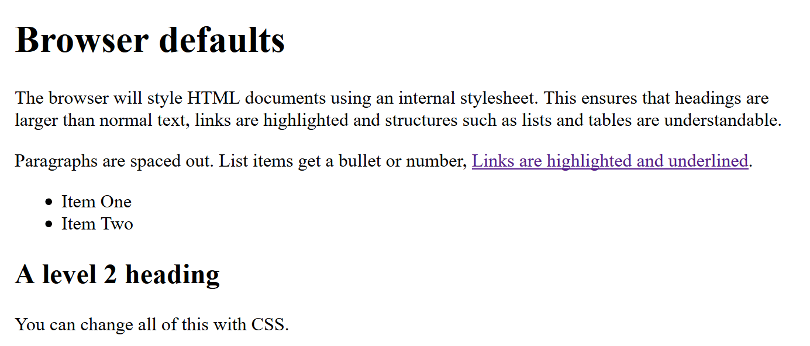
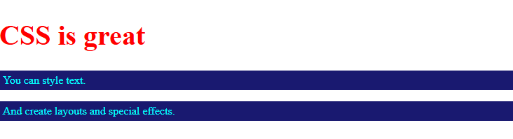
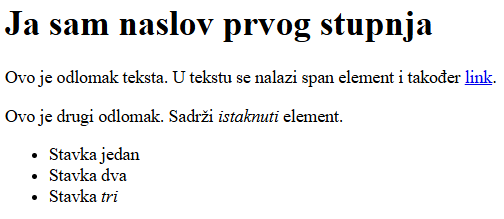
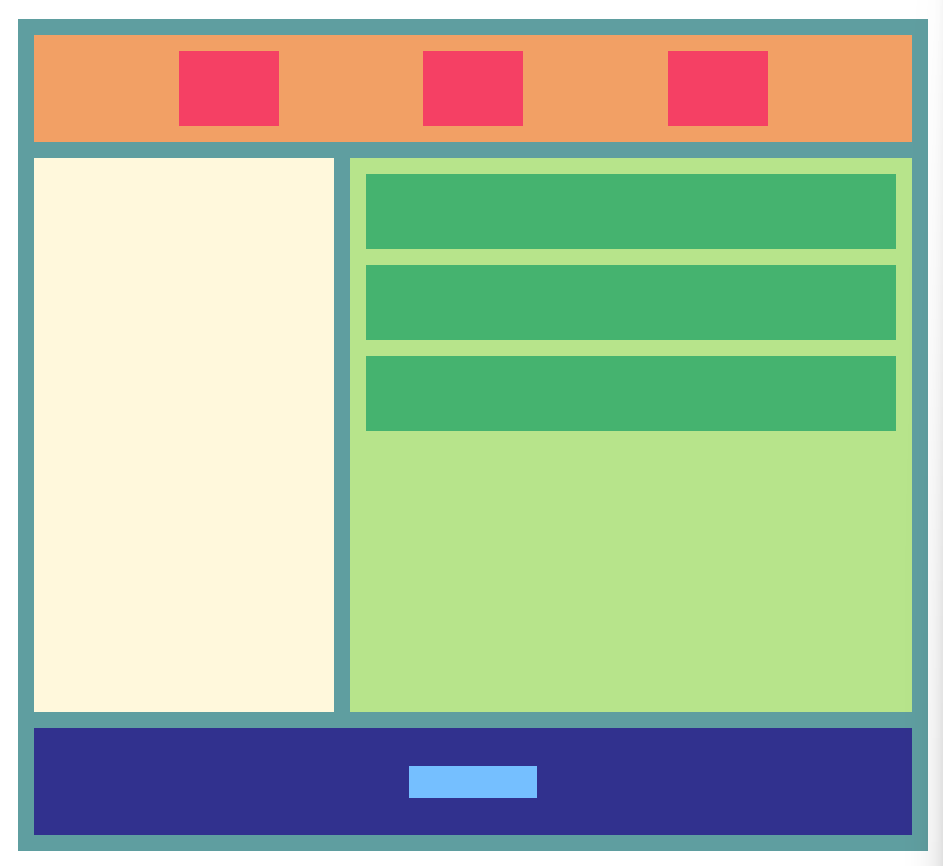
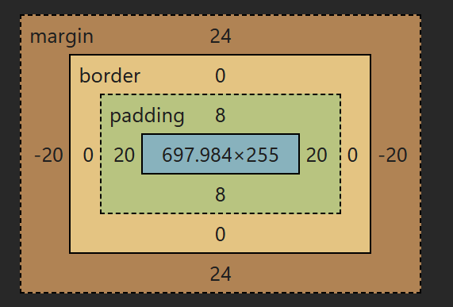

<div>

# Web dizajn i aplikacija

**Nositelj**: izv. prof. dr. sc. Snježana  
**Suradnik**: mag. inf. Alesandro Žužić  

**Ustanova**: Sveučilište Jurja Dobrile u Puli, Fakultet dizajn i audiovizualne komunikacije

<p style="float: clear; display: flex; gap: 8px; align-items: center;" class="font-brioni text-sm whitespace-nowrap">
    </img>
    Fakultet dizajn i audiovizualne komunikacije
</p>

# [1] CSS Osnove

**Posljednje ažurirano:** 04. studenog 2025.

## Sadržaj
<!-- TOC -->

- [Web dizajn i aplikacija](#web-dizajn-i-aplikacija)
- [[1] CSS Osnove](#1-css-osnove)
    - [Sadržaj](#sadr%C5%BEaj)
    - [Uvod](#uvod)
        - [Što je CSS?](#%C5%A0to-je-css)
            - [Zadani stilovi preglednika](#zadani-stilovi-preglednika)
        - [Čemu služi CSS?](#%C4%8Cemu-slu%C5%BEi-css)
        - [Osnove CSS sintakse](#osnove-css-sintakse)
            - [Kako se CSS primjenjuje na HTML?](#kako-se-css-primjenjuje-na-html)
    - [Početak rada s CSS-om](#po%C4%8Detak-rada-s-css-om)
        - [Dodavanje CSS-a u HTML dokument](#dodavanje-css-a-u-html-dokument)
            - [Unutarnji stilovi Internal stylesheets](#unutarnji-stilovi-internal-stylesheets)
            - [Inline stilovi Inline styles](#inline-stilovi-inline-styles)
        - [Vanjski stilovi External stylesheets](#vanjski-stilovi-external-stylesheets)
    - [Osnovni CSS stilovi](#osnovni-css-stilovi)
        - [Text](#text)
            - [Boja teksta](#boja-teksta)
            - [Veličina teksta](#veli%C4%8Dina-teksta)
            - [Bold, italic & dekoracije teksta](#bold-italic--dekoracije-teksta)
            - [Poravnanje teksta](#poravnanje-teksta)
        - [Samostalni zadatak za vježbu 1](#samostalni-zadatak-za-vje%C5%BEbu-1)
        - [Visina i širina](#visina-i-%C5%A1irina)

<!-- /TOC -->

## Uvod

**CSS** (*Cascading Style Sheets*) je jezik za opis prezentacije dokumenta napisanog u HTML-u ili XML-u (*uključujući XML varijante poput SVG-a, MathML-a ili XHTML-a*). CSS definira kako elementi trebaju biti prikazani na ekranu, na papiru ili na drugim medijima.

> Cilj CSS-a je odvojiti strukturu sadržaja od njegova izgleda, što olakšava održavanje i razvoj web projekata

### Što je CSS?

CSS omogućuje izradu estetski oblikovanih web stranica, ali kako zapravo funkcionira u pozadini? Dalje ćemo proći što je CSS, kako izgleda osnovna sintaksa te na koji način preglednik primjenjuje CSS na HTML kako bi ga stilizirao.

#### Zadani stilovi preglednika

U prošloj skripti pokrili smo što je HTML i kako se koristi za označavanje dokumenata. Ti dokumenti su čitljivi u web pregledniku. Naslovi će izgledati veći od običnog teksta, odlomci se prelamaju u novi red i imaju razmak između njih. Linkovi su obojeni i podcrtani kako bi se razlikovali od ostatka teksta.

<div style="width: fit-content; display: flex; flex-direction: column;">
    <div style="display: flex; justify-content: center;">
        
    </div>
    <br/>
    <p style="margin-top: -16px; width: 100%; text-align: center;"><i>Primjer Atributa</i></p>
</div>

Ono što vidite su **zadani stilovi preglednika** - vrlo osnovno oblikovanje koje preglednik primjenjuje na HTML kako bi osigurao čitljivost stranice čak i ako autor stranice nije definirao vlastite stilove. Ti stilovi definirani su u zadanim CSS stilskim datotekama unutar preglednika i nemaju veze s HTML-om.

> Web bi bio dosadan da sve web stranice izgledaju tako. Zato je važno naučiti koristiti CSS.

### Čemu služi CSS?

Korištenjem CSS-a možemo točno kontrolirati kako HTML elementi izgledaju u pregledniku, prikazujući svoje dokumente korisnicima s dizajnom i rasporedom koji želimo.

- **Dokument** je obično tekstualna datoteka strukturirana pomoću jezika za označavanje, najčešće HTML-a (*takvi se dokumenti nazivaju HTML dokumenti*). Također možemo naići na dokumente napisane u drugim jezicima za označavanje, poput SVG-a ili XML-a. HTML dokument sadrži sadržaj web stranice i određuje njezinu strukturu.

- **Prikazivanje** dokumenta korisniku znači pretvaranje dokumenta u oblik koji je upotrebljiv za publiku. Preglednici poput *Firefoxa, Chromea, Safarija i Edgea* dizajnirani su za vizualno prikazivanje dokumenata, primjerice na ekranu računala, projektoru, mobilnom uređaju i drugim. U web kontekstu, ovo se općenito naziva **rendering**.

> Preglednik se ponekad naziva **user agent**, što znači računalni program koji predstavlja osobu unutar računalnog sustava.

CSS se može koristiti za mnoge svrhe vezane uz izgled i dojam vaše web stranice, primjerice:

- Stiliziranje teksta, uključujući promjenu boje i veličine naslova i linkova
- Kreiranje rasporeda, poput grid layouta ili višekolumnskih rasporeda
- Posebni efekti, poput animacija

### Osnove CSS sintakse

CSS je jezik temeljen na **pravilima** - definirate pravila specificiranjem **skupova stilova** koji se trebaju primijeniti na određeni element ili skup elemenata na web stranici.

Na primjer, možete odlučiti da glavnom naslovu na stranici dodijelite veliki crveni tekst. 
*Sljedeći kôd prikazuje jednostavno CSS pravilo koje to postiže:*

```css
h1 {
  color: blue;
  font-size: 12px;
}
```

- U ovom primjeru CSS pravilo počinje **selektorom**, koji odabire HTML elemente koje ćemo stilizirati. Ovdje stiliziramo naslov prvog stupnja (`<h1>`).
- Zatim koristimo **vitičaste zagrade** `{ }`.
- Unutar zagrada nalaze se **deklaracije**, koje su u obliku parova `svojstvo: vrijednost`.
    - `color` je svojstvo, a `blue` je njegova vrijednost
    - `font-size` je svojstvo, a `12px` je njegova vrijednost
- Različita CSS svojstva imaju različite dopuštene vrijednosti. Primjerice:
    - `color` može imati različite vrijednosti boja
    - `font-size` može imati različite veličine


*CSS stil sadrži mnoge ovakve definicije, napisane jedna za drugom:*

```css
h1 {
  color: red;
}

p {
  color: aqua;
  padding: 5px;
  background: midnightblue;
}
```

Neke vrijednosti ćemo brzo zapamtiti, dok ćemo druge morati tražiti.

> Sva CSS svojstva i druge CSS značajke možemo pronaći u [MDN CSS](https://developer.mozilla.org/en-US/docs/Web/CSS). Također, dobra je praksa tražiti "mdn naziv-svojstva" u tražilici kada trebamo više informacija, npr. "mdn color" ili "mdn font-size".

#### Kako se CSS primjenjuje na HTML?

Kada otvorimo web stranicu, preglednik prvo prima HTML dokument koji sadrži sadržaj stranice i pretvara ga u **DOM stablo** (*Document Object Model*).

Nakon toga, sva CSS pravila koja se nalaze na stranici - bilo direktno u HTML-u ili u referenciranim vanjskim `.css` datotekama - raspoređuju se u različite "spremnike" prema elementima na koje se primjenjuju (*prema selektorima*). CSS pravila se zatim primjenjuju na DOM stablo, stvarajući **render stablo**, koje se na kraju prikazuje u prozoru preglednika.

*Primjer HTML:*

```html
<h1>CSS is great</h1>

<p>You can style text.</p>

<p>And create layouts and special effects.</p>
```

*CSS pravila:*

```css
h1 {
  color: red;
  font-size: 2.5em;
}

p {
  color: aqua;
  padding: 5px;
  background: midnightblue;
}
```

Ova CSS pravila:

- Odabiru sve `<h1>` elemente na stranici, boje njihov tekst u crveno i povećavaju veličinu teksta. U našem primjeru postoji samo jedan `<h1>`, pa samo on dobiva stil.
- Odabiru sve `<p>` elemente na stranici, daju im prilagođenu boju teksta i pozadine te razmak oko teksta. U primjeru postoje dva `<p>` elementa i oba dobivaju stil.

Kada se CSS primijeni na HTML, preglednik prikazuje elemente sa zadanim stilovima iz CSS-a.

<div style="width: fit-content; display: flex; flex-direction: column;">
    <div style="display: flex; justify-content: center;">
        
    </div>
    <br/>
    <p style="margin-top: -16px; width: 100%; text-align: center;"><i>Primjer CSS-a</i></p>
</div>

## Početak rada s CSS-om

Početna točka je HTML dokument. Kôd možemo kopirati i spremiti na svoje računalo kao `index.html` u nekom folderu.

```html
<!doctype html>
<html>
    <head>
        <title>Početak rada s CSS-om</title>
    </head>

    <body>
        <h1>I am a level one heading</h1>

        <p>
            This is a paragraph of text. In the text is a
            <span>span element</span> and also a
            <a href="https://example.com">link</a>.
        </p>

        <p>
            This is the second paragraph. It contains an <em>emphasized</em> element.
        </p>

        <ul>
            <li>Item <span>one</span></li>
            <li>Item two</li>
            <li>Item <em>three</em></li>
        </ul>
    </body>
</html>
```

<div style="width: fit-content; display: flex; flex-direction: column;">
    <div style="display: flex; justify-content: center;">
        
    </div>
    <br/>
    <p style="margin-top: -16px; width: 100%; text-align: center;"><i>HTML kôd</i></p>
</div>

Ovaj HTML će se prikazati u pregledniku sa standardnim stilovima: naslovi veći, odlomci s razmakom, linkovi plavi i podcrtani, itd.

### Dodavanje CSS-a u HTML dokument

Da bi HTML dokument koristio CSS pravila, potrebno je CSS povezati s dokumentom. Postoje tri uobičajena načina: **interni stilovi**, **inline stilovi** i **eksterni stilovi**.

---

#### Unutarnji stilovi (*Internal stylesheets*)

Unutarnji stilovi se nalaze unutar `<style>` elementa u `<head>` dijelu HTML dokumenta.

*Primjer:*

```html
<html>
    <head>
        <title>Primjer</title>
        <style>
            em {
                color: red;
            }
        </style>
    </head>

    <body>
        <p>
            Ovo je primjer unutarnjeg stila. Sadrži <em>em</em> selektor.
        </p>
    </body>
</html>
```

---

#### Inline stilovi (*Inline styles*)

Inline stilovi primjenjuju CSS direktno na pojedini HTML element pomoću **atributa `style`**.

Primjer:

```html
<html>
    <head>
        <title>Primjer</title>
    </head>

    <body>
        <p>
            Ovaj <span style="color: red; font-weight: bold">span element</span> ima inline stil.
        </p>
    </body>
</html>
```

> **Napomena:** Inline stilove je najbolje izbjegavati jer:
> - Otežavaju održavanje (*jedna promjena zahtijeva više izmjena*)
> - Miješaju sadržaj (*HTML*) i prezentaciju (*CSS*)
>
> Ipak, ponekad su nužni, npr. u HTML emailovima.

---

### Vanjski stilovi (*External stylesheets*)

Vanjski stilovi pohranjeni su u zasebnoj `.css` datoteci i najčešće su najpraktičniji način dodavanja CSS-a.

1. Kreiramo datoteku `styles.css` u istom folderu kao HTML dokument.
2. U `<head>` dijelu HTML-a dodajemo `<link rel="stylesheet" href="relativna_putanja_do_datoteke">` element:

```html
<html>
    <head>
        <title>Primjer</title>
        <link rel="stylesheet" href="styles.css" />
    </head>

    <body>
        <h1>Ovaj HTML dokument koristi vanjski stil</h1>
    </body>
</html>
```

Primjer sadržaja `styles.css`:

```css
    h1 {
        color: red;
        font-size: 2.5em;
    }
```

> Vanjski stilovi omogućuju primjenu istog CSS-a na više stranica i olakšavaju održavanje web stranice

> Najbolja praksa je koristiti **vanjski CSS** za većinu stiliziranja, povremeno koristiti unutarnje stilove u specifičnim slučajevima i inline stilove samo ako je to nužno.

## Osnovni CSS stilovi

Ovdje ćemo proći najosnovnije i najčešće korištene CSS stilove.

### Text

Najčešće korišteni podatak u bilo kojoj aplikaciji, koji čini većinu web stranice, jest tekst. Zato je važno da je pravilno oblikovan te da se jasno razlikuju različiti tipovi teksta, poput naslova, zaglavlja, tijela, sekcija itd.

Ključni stilovi koji se najčešće koriste za oblikovanje teksta su:
- **boja teksta i pozadine** (*color*, *background*)
- **veličina fonta** (*font-size*)
- **stil fonta** (*font style*)
- **poravnanje teksta** (*text align*)
- **prelom teksta** (*text wrap*)

#### Boja teksta i pozadine
```css
color: blue;
background: yellow;
```
<div style="width: fit-content; display: flex; flex-direction: column;">
    <div style="display: flex; justify-content: center;">
        
    </div>
    <br/>
    <p style="margin-top: -16px; width: 100%; text-align: center;"><code>color</code> & <code>background</code></p>
</div>

Boja se može napisati koristeći različite formate (*naziv predefinirane boje, rgb, hex, hsl, lab, lch, ...*):
```css
color: blue;
color: rgb(0, 0, 255);
color: #0000ff;
color: hsl(240, 100%, 50%);
color: lab(32.3% 79.2 -107.86);
color: lch(32.3% 133.82 306.29);
```

*Tablica boja:*

| Boja            | Prikaz                                                                                                                      | Naziv        |
| --------------- | --------------------------------------------------------------------------------------------------------------------------- | ---------- |
| Crvena          | <span style="display:inline-block;width:60px;height:30px;background:red;border-radius:6px;"></span>                         | red        |
| Plava           | <span style="display:inline-block;width:60px;height:30px;background:blue;border-radius:6px;"></span>                        | blue       |
| Zelena          | <span style="display:inline-block;width:60px;height:30px;background:green;border-radius:6px;"></span>                       | green      |
| Žuta            | <span style="display:inline-block;width:60px;height:30px;background:yellow;border-radius:6px;"></span>                      | yellow     |
| Crna            | <span style="display:inline-block;width:60px;height:30px;background:black;border-radius:6px;"></span>                       | black      |
| Bijela          | <span style="display:inline-block;width:60px;height:30px;background:white;border:1px solid #000;border-radius:6px;"></span> | white      |
| Magenta         | <span style="display:inline-block;width:60px;height:30px;background:magenta;border-radius:6px;"></span>                     | magenta    |
| Cyan            | <span style="display:inline-block;width:60px;height:30px;background:cyan;border-radius:6px;"></span>                        | cyan       |
| Narančasta      | <span style="display:inline-block;width:60px;height:30px;background:orange;border-radius:6px;"></span>                      | orange     |
| Ljubičasta      | <span style="display:inline-block;width:60px;height:30px;background:purple;border-radius:6px;"></span>                      | purple     |
| Smeđa           | <span style="display:inline-block;width:60px;height:30px;background:brown;border-radius:6px;"></span>                       | brown      |
| Roza            | <span style="display:inline-block;width:60px;height:30px;background:pink;border-radius:6px;"></span>                        | pink       |
| Siva            | <span style="display:inline-block;width:60px;height:30px;background:gray;border-radius:6px;"></span>                        | gray       |
| Svijetlo plava  | <span style="display:inline-block;width:60px;height:30px;background:lightblue;border-radius:6px;"></span>                   | lightblue  |
| Svijetlo zelena | <span style="display:inline-block;width:60px;height:30px;background:lightgreen;border-radius:6px;"></span>                  | lightgreen |
| Zlatna          | <span style="display:inline-block;width:60px;height:30px;background:gold;border-radius:6px;"></span>                        | gold       |
| Tirkizna        | <span style="display:inline-block;width:60px;height:30px;background:turquoise;border-radius:6px;"></span>                   | turquoise  |

#### Veličina teksta
```css
font-size: 36px;
```

<div style="width: fit-content; display: flex; flex-direction: column;">
    <div style="display: flex; justify-content: center;">
        
    </div>
    <br/>
    <p style="margin-top: -16px; width: 100%; text-align: center;"><code>font-size</code></p>
</div>

*Tablica veličina:*

| rem | 0.75 | 0.875 | 1  | 1.125 | 1.25 | 1.5 | 1.875 | 2.25 | 3  | 3.75 | 4.5 | 6  | 8   |
| --- | ---- | ----- | -- | ----- | ---- | --- | ----- | ---- | -- | ---- | --- | -- | --- |
| px  | 12   | 14    | 16 | 18    | 20   | 24  | 30    | 36   | 48 | 60   | 72  | 96 | 128 |

  <div style="line-height: calc(1 / 0.75); font-size: 12px;">text-12</div>
  <div style="line-height: calc(1.25 / 0.875); font-size: 14px;">text-14</div>
  <div style="line-height: calc(1.5 / 1); font-size: 16px;">text-16</div>
  <div style="line-height: calc(1.75 / 1.125); font-size: 18px;">text-18</div>
  <div style="line-height: calc(1.75 / 1.25); font-size: 20px;">text-20</div>
  <div style="line-height: calc(1.75 / 1.25); font-size: 24px;">text-24</div>
  <div style="line-height: calc(2 / 1.5); font-size: 30px;">text-30</div>
  <div style="line-height: calc(2.25 / 1.875); font-size: 36px;">text-36</div>
  <div style="line-height: calc(2.5 / 2.25); font-size: 48px;">text-48</div>
  <div style="line-height: 1; font-size: 60px;">text-60</div>
  <div style="line-height: 1; font-size: 72px;">text-72</div>
  <div style="line-height: 1; font-size: 96px;">text-96</div>
  <div style="line-height: 1; font-size: 128px;">text-128</div>

#### Bold, italic & dekoracije teksta
```css
font-style: italic;
font-weight: bold;

text-decoration: underline;
text-decoration: overline;
text-decoration: line-through;
text-decoration: dashed;
text-decoration: dotted;
text-decoration: double;
text-decoration: wavy;
```


#### Poravnanje teksta

```css
text-align: left;
text-align: center;
text-align: right;
text-align: justify;
```

- Pod poravnanje teksta spadaju klase: *lijevo, centrirano, desno i obostrano*

| Klasa     | Opis                                    |
| --------- | --------------------------------------- |
| `left`    | poravnava tekst uz lijevi rub elementa. |
| `center`  | poravnava tekst u centar elementa       |
| `right`   | poravnava tekst uz desni rub elementa   |
| `justify` | raspoređuje tekst po širini elementa    |

<br>
<div style="display: flex; flex-wrap: wrap; gap: 16px;">

<div style="width: 180px; text-align: left; background:rgba(60, 60, 60, 0.2); border-radius: 8px; padding: 8px;">
<b>text-align: left;</b>
<hr>
<div style="text-align: left;">Diam et duo accusam lorem sed et at tempor est clita. Gubergren invidunt at rebum eos et est sanctus.</div>
</div>

<div style="width: 180px; text-align: center; background:rgba(60, 60, 60, 0.2); border-radius: 8px; padding: 8px;">
<b>text-align: center;</b>
<hr>
<div style="text-align: center;">Diam et duo accusam lorem sed et at tempor est clita. Gubergren invidunt at rebum eos et est sanctus.</div>
</div>

<div style="width: 180px; text-align: right; background:rgba(60, 60, 60, 0.2); border-radius: 8px; padding: 8px;">
<b>text-align: right;</b>
<hr>
<div style="text-align: right;">Diam et duo accusam lorem sed et at tempor est clita. Gubergren invidunt at rebum eos et est sanctus.</div>
</div>

<div style="width: 180px; text-align: justify; background:rgba(60, 60, 60, 0.2); border-radius: 8px; padding: 8px;">
<b>text-align: justify;</b>
<hr>
<div style="text-align: justify;">Diam et duo accusam lorem sed et at tempor est clita. Gubergren invidunt at rebum eos et est sanctus.</div>
</div>

</div>

---

### Samostalni zadatak za vježbu 1

Na zadanom HTML kodu primijeni CSS tako da postigneš sljedeće:

1. Naslov (`h1`) neka bude **plave boje**, **bold**, veličine **36px**.
2. Podnaslov (`h2`) neka bude **italic**, **zelene boje**, veličine **24px**.
3. Odlomak (`p`) neka bude **justify**, veličine **20px**, boje **crne**.
4. Element `<span>` unutar odlomka neka bude **underline** i boje **salmon**.
5. Artikl `<article>` neka ima pozadinsku boju **lightgoldenrodyellow**.

*Zadani HTML kod:*
```html
<article>
  <h1>Planiranje putovanja</h1>
  <h2>Kako organizirati savršeni odmor</h2>
  <p>Priprema je ključ uspješnog putovanja. <span>Detaljno planiranje</span> pomaže izbjeći stres i gubitak vremena.</p>
</article>

<article>
  <h1>Zdrava prehrana</h1>
  <h2>Osnove uravnotežene prehrane</h2>
  <p>Uravnotežena prehrana uključuje voće, povrće i proteine. <span>Redoviti obroci</span> pomažu održavanju energije tijekom dana.</p>
</article>

<article>
  <h1>Održavanje vrta</h1>
  <h2>Sezonske aktivnosti i savjeti</h2>
  <p>Redovito zalijevanje i orezivanje pomaže zdravom rastu biljaka. <span>Pravilna njega</span> povećava prinos i estetski izgled vrta.</p>
</article>
```

<div style="width: fit-content; display: flex; flex-direction: column;">
    <div style="display: flex; justify-content: center;">
        
    </div>
    <br/>
    <p style="margin-top: -16px; width: 100%; text-align: center;"><i>Primjer rješenja samostalnog zadatka 1</i></p>
</div>

---

### Korištenje CSS klasa

CSS klase omogućuju ponovno korištenje istih stilova na više elemenata. Korištenje klasa je praktično i organizirano jer omogućuje grupiranje stilova prema funkciji ili svrsi.

#### Definiranje klase

```css
.highlight {
    color: white;
    background-color: red;
    padding: 8px;
    border-radius: 4px;
}
```

- `highlight` je naziv klase
- Stilovi unutar `{ }` primjenjuju se na sve elemente koji imaju ovu klasu

*Primjena klase u HTML-u:*

```html
<p class="highlight">Ovaj tekst je istaknut pomoću klase.</p>
<div class="highlight">Ovaj div također koristi istu klasu.</div>
```
<div style="width: fit-content; display: flex; flex-direction: column;">
    <div style="display: flex; justify-content: center;">
        
    </div>
    <br/>
    <p style="margin-top: -16px; width: 100%; text-align: center;"><i>Korištenje klasa</i></p>
</div>

*Element može imati više klasa odvojene razmakom:*

```html
<p class="highlight bold large-text">Tekst s više klasa</p>
```

```css
.bold {
    font-weight: bold;
}

.large-text {
    font-size: 24px;
}
```

<div style="width: fit-content; display: flex; flex-direction: column;">
    <div style="display: flex; justify-content: center;">
        
    </div>
    <br/>
    <p style="margin-top: -16px; width: 100%; text-align: center;"><i>Kombinacija klasa</i></p>
</div>

- Klase imaju veću specifičnost od univerzalnog selektora (`*`)
- Ako element ima više klasa, svi stilovi se primjenjuju, osim ako nije prebrisano posebnim selektorom

*Primjeri:*

```css
.card {
    background-color: #f0f0f0;
    border-radius: 8px;
    border: 1px solid #ccc;
}

.alert {
    color: white;
    background-color: crimson;
    border-radius: 4px;
}

.success {
    color: white;
    background-color: green;
    border-radius: 4px;
}
```

```html
<div>
    <div class="card" style="width:150px; text-align: center;">
        Card
    </div>
    <div class="alert" style="width:150px; text-align: center;">
        Alert
    </div>
    <div class="success" style="width:150px; text-align: center;">
        Success
    </div>
</div>
```

<div style="display: flex; gap: 16px;">
<div style="width:150px; text-align:center;background-color:#f0f0f0; border-radius:8px; border:1px solid #ccc;">
    Card
</div>
<div style="width:150px; text-align:center;background-color:crimson; color:white; border-radius:4px;">
    Alert
</div>
<div style="width:150px; text-align:center;background-color:green; color:white; border-radius:4px;">
    Success
</div>
</div>

---

### Visina i širina

Svi elementi imaju svoju visinu i širinu, koje ponekad želimo prilagoditi prema potrebi. Elementima zato možemo namjestiti njihovu:
- visinu (*height*) i širinu (*width*)
- maksimalnu visinu (*max-height*) i maksimalnu širinu (*max-width*)
- minimalnu visinu (*min-height*) i minimalnu širinu (*min-width*)

```css
/* Element zauzima veličinu prozora */
div {
    width: 100vw;
    height: 100vh;
}

/* Element prilagođava veličinu svom sadržaju */
div {
    width: fit-content;
    height: fit-content;
}

/* Element zauzima punu veličinu dostupnog prostora */
div {
    width: 100%;
    height: 100%;
}

/* Element ima minimalnu veličinu prema sadržaju */
div {
    min-width: 50px;  /* primjer minimalne širine */
    min-height: 50px; /* primjer minimalne visine */
}

/* Element ima maksimalnu veličinu, ali može se smanjivati */
div {
    max-width: 600px;  /* primjer maksimalne širine */
    max-height: 400px; /* primjer maksimalne visine */
    width: 100%;
    height: 100%;
}

/* Element veličine 1px */
div {
    width: 1px;
    height: 1px;
}
```

*Predefinirane vrijednosti:*

| Klasa    | Opis                                                                    |
| -------- | ----------------------------------------------------------------------- |
| `100vh` | element zauzima veličinu prozora aplikacije                             |
| `fit-content`    | element zauzima veličinu prema svom sadržaju (*djece*)                    |
| `100%`   | element zauzima punu veličinu dostupnog prostora |
| `min-content`    | element ima minimalnu veličinu, ovisno o sadržaju                       |
| `max-content`    | element ima maksimalnu veličinu, ali može se smanjivati prema potrebama |

*Primjer fiksnih veličina u pikselima:* 

<div style="display: flex; flex-direction: column; gap: 4px; padding: 8px; width: fit-content; background: rgba(60, 60, 60, 0.2); border-radius: 16px;">
<div style="width: 384px; text-wrap: wrap; background: #3c3c3c; color: #cccccc; border-radius: 8px; text-align: center;">384px</div>
<div style="width: 256px; text-wrap: wrap; background: #3c3c3c; color: #cccccc; border-radius: 8px; text-align: center;">256px</div>
<div style="width: 144px; text-wrap: wrap; background: #3c3c3c; color: #cccccc; border-radius: 8px; text-align: center;">144px</div>
<div style="width: 80px; text-wrap: wrap; background: #3c3c3c; color: #cccccc; border-radius: 8px; text-align: center;">80px</div>
<div style="width: 36px; text-wrap: wrap; background: #3c3c3c; color: #cccccc; border-radius: 8px; text-align: center;">36px</div>
</div>

<br>

*Primjer omjera u postocima:* 

<div style="display: flex; flex-direction: column; gap: 4px; padding: 8px; background:rgba(60, 60, 60, 0.2); border-radius: 16px;">
<div style="width: 90%; text-wrap: wrap; background: #3c3c3c; color: #cccccc; border-radius: 8px; text-align: center;">90%</div>
<div style="width: 66%; text-wrap: wrap; background: #3c3c3c; color: #cccccc; border-radius: 8px; text-align: center;">66.6%</div>
<div style="width: 50%; text-wrap: wrap; background: #3c3c3c; color: #cccccc; border-radius: 8px; text-align: center;">50%</div>
<div style="width: 40%; text-wrap: wrap; background: #3c3c3c; color: #cccccc; border-radius: 8px; text-align: center;">40%</div>
<div style="width: 33%; text-wrap: wrap; background: #3c3c3c; color: #cccccc; border-radius: 8px; text-align: center;">33.3%</div>
<div style="width: 12.5%; text-wrap: wrap; background: #3c3c3c; color: #cccccc; border-radius: 8px; text-align: center;">12.5%</div>
</div>

<br>

*Primjer predefiniranih veličina:* 

<div style="display: flex; width: 500px; flex-direction: column; gap: 4px; padding: 8px; background:rgba(60, 60, 60, 0.2); border-radius: 16px;">
<span><b>100vh</b> - ignorira širinu roditelja</span>
<div style="padding: 0px 4px;width: 100vw; background: #3c3c3c; color: #cccccc; border-radius: 8px;">Diam et duo accusam lorem sed et at tempor est clita. Gubergren invidunt at rebum eos et est sanctus.</div>
<span style="margin-top: 8px;"><b>100%</b> - zauzima 100% širinu roditelja</span>
<div style="padding: 0px 4px;width: full; background: #3c3c3c; color: #cccccc; border-radius: 8px;">Diam et duo accusam lorem sed et at tempor est clita. Gubergren invidunt at rebum eos et est sanctus.</div>
<div style="padding: 0px 4px;width: full; background: #3c3c3c; color: #cccccc; border-radius: 8px;">Diam et duo accusam lorem sed et at tempor est clita.</div>
<span style="margin-top: 8px;"><b>max-content</b> - zauzima maksimalnu veličinu sadržaja ignorirajući širinu roditelja</span>
<div style="padding: 0px 4px;width: max-content; background: #3c3c3c; color: #cccccc; border-radius: 8px;">Diam et duo accusam lorem sed et at tempor est clita. Gubergren invidunt at rebum eos et est sanctus.</div>
<div style="padding: 0px 4px;width: max-content; background: #3c3c3c; color: #cccccc; border-radius: 8px;">Diam et duo accusam lorem sed et at tempor est clita.</div>
<span style="margin-top: 8px;"><b>fit-content</b> - zauzima veličinu prema sadržaju</span>
<div style="padding: 0px 4px;width: fit-content; background: #3c3c3c; color: #cccccc; border-radius: 8px;">Diam et duo accusam lorem sed et at tempor est clita. Gubergren invidunt at rebum eos et est sanctus.</div>
<div style="padding: 0px 4px;width: fit-content; background: #3c3c3c; color: #cccccc; border-radius: 8px;">Diam et duo accusam lorem sed et at tempor est clita.</div>
<span style="margin-top: 8px;"><b>min-content</b> - zauzima minimalnu veličinu sadržaja</span>
<div style="padding: 0px 4px; width: min-content; background: #3c3c3c; color: #cccccc; border-radius: 8px;">Diam et duo accusam lorem sed et at tempor est clita.</div>
</div>

---

### Border i obrubi elemenata

Elementi na webu često trebaju obrube ili granice kako bi se vizualno odvojili ili naglasili. CSS omogućuje širok spektar stilova obruba: debljinu, boju, stil i zaobljene rubove.

#### Osnovni border

```css
border: 2px solid black;
```

- `2px` – debljina obruba
- `solid` – stil obruba (*dashed, dotted, double, groove, ridge, inset, outset, none, hidden*)
- `black` – boja obruba

#### Border-radius

Zaobljeni rubovi elemenata:

```css
border-radius: 8px;
```

- Veličina u px, rem, %
- Može se primijeniti na sve rubove ili pojedinačno (`border-top-left-radius`, `border-bottom-right-radius`, …)

*Primjeri zaobljenja:*

<div style="display: flex; flex-wrap: wrap; align-items: end; gap: 8px; padding: 8px; background:rgba(60, 60, 60, 0.2); border-radius: 8px;">
    <div style="width: 75px; height: 75px; background: #3c3c3c; color: #cccccc; border-radius: 0px; text-align: center; align-content: center;">0px</div>
    <div style="width: 75px; height: 75px; background: #3c3c3c; color: #cccccc; border-radius: 2px; text-align: center; align-content: center;">2px</div>
    <div style="width: 75px; height: 75px; background: #3c3c3c; color: #cccccc; border-radius: 4px; text-align: center; align-content: center;">4px</div>
    <div style="width: 75px; height: 75px; background: #3c3c3c; color: #cccccc; border-radius: 6px; text-align: center; align-content: center;">6px</div>
    <div style="width: 75px; height: 75px; background: #3c3c3c; color: #cccccc; border-radius: 8px; text-align: center; align-content: center;">8px</div>
    <div style="width: 75px; height: 75px; background: #3c3c3c; color: #cccccc; border-radius: 12px; text-align: center; align-content: center;">12px</div>
    <div style="width: 75px; height: 75px; background: #3c3c3c; color: #cccccc; border-radius: 16px; text-align: center; align-content: center;">16px</div>
    <div style="width: 75px; height: 75px; background: #3c3c3c; color: #cccccc; border-radius: 24px; text-align: center; align-content: center;">24px</div>
    <div style="width: 75px; height: 75px; background: #3c3c3c; color: #cccccc; border-radius: 9999px; text-align: center; align-content: center;">9999px</div>
</div>

#### Border po stranama

```css
border-top: 4px dashed red;
border-right: 2px solid blue;
border-bottom: 3px dotted green;
border-left: 1px double purple;
```

*Svojstva obruba*

| Svojstvo                                                        | Opis                                                                            |
| --------------------------------------------------------------- | ------------------------------------------------------------------------------- |
| `border-width`                                                  | Debljina obruba (px, rem, %)                                                    |
| `border-style`                                                  | Stil obruba (solid, dashed, dotted, double, groove, ridge, inset, outset, none) |
| `border-color`                                                  | Boja obruba (naziv boje, hex, rgb, hsl)                                         |
| `border-radius`                                                 | Zaobljenje rubova (px, %, rem)                                                  |
| `border-top` / `border-right` / `border-bottom` / `border-left` | Individualni obrubi po stranama                                                 |

#### Primjeri CSS-a

```css
.box1 {
    border: 2px solid black;
}

.box2 {
    border: 3px dashed red;
    border-radius: 12px;
}

.box3 {
    border-top: 4px solid blue;
    border-bottom: 4px dotted green;
    border-left: 2px dashed orange;
    border-right: 2px double purple;
    border-radius: 16px;
}
```

<div style="display: flex; flex-wrap: wrap; gap: 16px;">

<div style="width: 150px; height: 80px; border: 2px solid black; border-radius: 4px; display:flex; justify-content:center; align-items:center;">Box1</div>

<div style="width: 150px; height: 80px; border: 3px dashed red; border-radius: 12px; display:flex; justify-content:center; align-items:center;">Box2</div>

<div style="width: 150px; height: 80px; border-top: 4px solid blue; border-bottom: 4px dotted green; border-left: 2px dashed orange; border-right: 2px double purple; border-radius: 16px; display:flex; justify-content:center; align-items:center;">Box3</div>

</div>

### Razmaci: Padding i Margin

Razmaci su ključni za raspored elemenata na stranici. CSS razlikuje **unutarnje razmake** (`padding`) i **vanjske razmake** (`margin`).

<div style="width: fit-content; display: flex; flex-direction: column;">
    <div style="display: flex; justify-content: center;">
        
    </div>
    <br/>
    <p style="margin-top: -16px; width: 100%; text-align: center;"><i>Razmaci</i></p>
</div>

#### Padding – unutarnji razmak

Unutarnji razmak je prostor između sadržaja elementa i njegovog obruba.

```css
padding: 16px;        /* jednaki razmak sa svih strana */
padding-top: 8px;     /* razmak samo s vrha */
padding-right: 12px;  /* razmak samo s desne strane */
padding-bottom: 20px; /* razmak samo s dna */
padding-left: 4px;    /* razmak samo s lijeve strane */
```

*Primjer unutarnjeg razmaka:*

<div style="display: flex; gap: 8px;">

<div style="display: flex; flex-direction: column; gap: 8px;">
    <div style="display: flex; justify-content: center;"><b>pt-8</b></div>
    <div style="height: fit-content; padding: 32px 8px 8px 8px; background: rgba(60, 60, 60, 0.2); border-radius: 16px;"> 
    <div style="display: flex; justify-content: center; align-items: center; height: 50px; width: 50px; background: #3c3c3c; color: #cccccc; border-radius: 8px;"></div> 
    </div>
</div>

<div style="display: flex; flex-direction: column; gap: 8px;">
    <div style="display: flex; justify-content: center;"><b>pb-8</b></div>
    <div style="height: fit-content; padding: 8px 8px 32px 8px; background: rgba(60, 60, 60, 0.2); border-radius: 16px;"> 
    <div style="display: flex; justify-content: center; align-items: center; height: 50px; width: 50px; background: #3c3c3c; color: #cccccc; border-radius: 8px;"></div>
    </div>
</div>

<div style="display: flex; flex-direction: column; gap: 8px;">
    <div style="display: flex; justify-content: center;"><b>pl-8</b></div>
    <div style="height: fit-content; padding: 8px 8px 8px 32px; background: rgba(60, 60, 60, 0.2); border-radius: 16px;"> 
    <div style="display: flex; justify-content: center; align-items: center; height: 50px; width: 50px; background: #3c3c3c; color: #cccccc; border-radius: 8px;"></div>
    </div>
</div>

<div style="display: flex; flex-direction: column; gap: 8px;">
    <div style="display: flex; justify-content: center;"><b>pr-8</b></div>
    <div style="height: fit-content; padding: 8px 32px 8px 8px; background: rgba(60, 60, 60, 0.2); border-radius: 16px;"> 
    <div style="display: flex; justify-content: center; align-items: center; height: 50px; width: 50px; background: #3c3c3c; color: #cccccc; border-radius: 8px;"></div>
    </div>
</div>

</div>

#### Margin – vanjski razmak

Vanjski razmak je prostor između elementa i drugih elemenata ili rubova roditelja.

```css
margin: 16px;          /* jednaki razmak sa svih strana */
margin-top: 8px;       /* razmak samo s vrha */
margin-right: 12px;    /* razmak samo s desne strane */
margin-bottom: 20px;   /* razmak samo s dna */
margin-left: 4px;      /* razmak samo s lijeve strane */
```

*Primjer vanjskog razmaka:*

<div style="display: flex;  flex-wrap: wrap; gap: 8px;">

<div style="height: 180px; width: 180px; padding: 8px; background: rgba(60, 60, 60, 0.2); border-radius: 16px;">
<div style="width: fit-content; margin: auto; padding: 8px; background: #3c3c3c; color: #cccccc; border-radius: 8px;">m-auto</div>
</div>

<div style="height: 180px; width: 180px; padding: 8px; background: rgba(60, 60, 60, 0.2); border-radius: 16px;"> 
<div style="width: fit-content; margin-top: 32px; padding: 8px; background: #3c3c3c; color: #cccccc; border-radius: 8px;">mt-8</div>
<div style="width: fit-content; margin-top: 32px; padding: 8px; background: #3c3c3c; color: #cccccc; border-radius: 8px;">mt-8</div>
</div>

<div style="display: flex; height: 180px; width: 180px; padding: 8px; background: rgba(60, 60, 60, 0.2); border-radius: 16px;"> 
<div style="height: fit-content; margin-left: 32px; padding: 8px; background: #3c3c3c; color: #cccccc; border-radius: 8px;">ml-8</div>
<div style="height: fit-content; margin-left: 32px; padding: 8px; background: #3c3c3c; color: #cccccc; border-radius: 8px;">ml-8</div>
</div>

<div style="height: 180px; width: 180px; padding: 8px; background: rgba(60, 60, 60, 0.2); border-radius: 16px;"> 
<div style="width: fit-content; margin-bottom: 32px; padding: 8px; background: #3c3c3c; color: #cccccc; border-radius: 8px;">mb-8</div>
<div style="width: fit-content; margin-bottom: 32px; padding: 8px; background: #3c3c3c; color: #cccccc; border-radius: 8px;">mb-8</div>
</div>

<div style="display: flex; height: 180px; width: 180px; padding: 8px; background: rgba(60, 60, 60, 0.2); border-radius: 16px;"> 
<div style="height: fit-content; margin-right: 32px; padding: 8px; background: #3c3c3c; color: #cccccc; border-radius: 8px;">mr-8</div> 
<div style="height: fit-content; margin-right: 32px; padding: 8px; background: #3c3c3c; color: #cccccc; border-radius: 8px;">mr-8</div>
</div>

</div>

<br>

*Tablica razmaka:*

| Svojstvo         | Opis                             |
| ---------------- | -------------------------------- |
| `padding`        | unutarnji razmak elementa        |
| `padding-top`    | unutarnji razmak na vrhu         |
| `padding-right`  | unutarnji razmak s desne strane  |
| `padding-bottom` | unutarnji razmak na dnu          |
| `padding-left`   | unutarnji razmak s lijeve strane |
| `margin`         | vanjski razmak elementa          |
| `margin-top`     | vanjski razmak na vrhu           |
| `margin-right`   | vanjski razmak s desne strane    |
| `margin-bottom`  | vanjski razmak na dnu            |
| `margin-left`    | vanjski razmak s lijeve strane   |

Ako svojstvo `margin` ima **dvije vrijednosti**:

```css
margin: 25px 50px;
```

- gornji i donji razmak su **25px**
- lijevi i desni razmak su **50px**

Ako svojstvo `margin` ima **četiri vrijednosti**:

```css
margin: 25px 50px 75px 100px;
```

- gornji razmak je **25px**
- desni razmak je **50px**
- donji razmak je **75px**
- lijevi razmak je **100px**

Također, svojstvo `margin` se može postaviti na `auto` da bi se element **horizontalno centrirao unutar svog roditeljskog elementa**.

```css
element {
    margin: 0 auto; /* centriranje horizontalno */
}
```

*Primjeri:*

```css
.container {
    padding: 20px;      /* unutarnji razmak svih strana */
    margin: 16px auto;  /* vanjski razmak, centrirano horizontalno */
    background-color: lightblue;
    border-radius: 8px;
}

.box-small {
    padding: 8px;
    margin: 4px;
    background-color: lightgreen;
}
```

```html
<div style="padding:20px; margin:16px auto; background-color:lightblue; border-radius:8px; width:200px; text-align:center;">
    Container
</div>
<div style="padding:8px; margin:4px; background-color:lightgreen; width:150px; text-align:center;">
    Box Small
</div>
```

<div style="width: fit-content; display: flex; flex-direction: column;">
    <div style="display: flex; justify-content: center;">
        
    </div>
    <br/>
    <p style="margin-top: -16px; width: 100%; text-align: center;"><i>Korištenje razmaka</i></p>
</div>

<br>

</div>